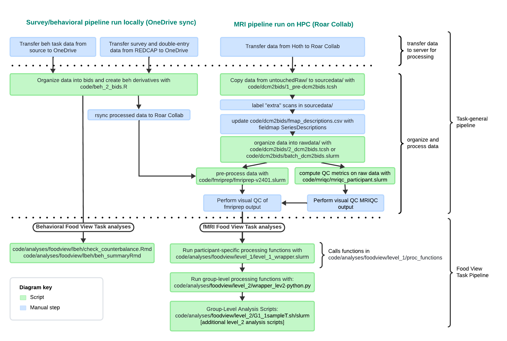

This folder contains code to process and analyze behavioral and fMRI data from the Food View Task collected as part of the Resiliency to the Effects of Advertising in Children (REACH) Study at Penn State (PI: Keller).

These scripts are meant to be run after following the task-general data processing pipeline, which includes [organizing data into BIDS](https://github.com/bfuchs18/R01_Marketing/tree/master/ParticipantData/bids/code/dcm2bids) and [pre-processing MRI data with fMRIprep](https://github.com/bfuchs18/R01_Marketing/tree/master/ParticipantData/bids/code/fmriprep) (Figure 1). Details about the task-general pipeline can be found in the [data processing manual](../../../../../docs/reach_data_management_manual.md).



**Folder organization and execution instructions:**

-   level_1/ contains code to run participant-level fmri data processing and analyses. This code is written to run on Penn State's HCP (Roar Collab).

    -   The primary script to run the level_1 pipeline is level_1_wrapper.slurm. This script calls functions in [level_1/proc_functions/](https://github.com/bfuchs18/R01_Marketing/tree/master/ParticipantData/bids/code/analyses/foodview/level_1/proc_functions). With command line arguments, this script will run the level_1 pipeline for specific IDs. Without arguments, this script will run the level_1 pipeline for all subjects with preprocessed fMRI data (fMRIPrep output):

        ``` bash
        # run level_1 pipeline for ids 001 and 002
        sbatch level_1_wrapper.slurm 001 002

        # run level_1 pipeline for all subs with preprocessed fmri data
        sbatch level_1_wrapper.slurm
        ```

-   level_2/ contains code to run group-level fmri data processing and analyses using files generated by level_1/ functions. This code is written to run on Penn State's HCP (Roar Collab).

    -   The primary script to run the level_2 processing pipeline is level_2_wrapper.slurm. This script calls the group-level processing functions level_2/gen\*. This script is to be run without command line arguments:

        ``` bash
        # run level_2 processing 
        sbatch level_2_wrapper.slurm
        ```

    -   After running the level_2 wrapper, analysis scripts (level_2/G\*) can be run in any order. Files ending in .sh contain analysis code and take command-line arguments. It is recommended to call these scripts via their associated .slurm files:

        ``` bash
        # run G1_1sampleT_FvT_reml.sh via job scheduler with G1_1sampleT_FvT_reml.slurm
        sbatch G1_1sampleT_FvT_reml.slurm
        ```

-   beh/ contains code to analyze task behavior independent of brain function. These scripts can be run locally on a computer with R installed if OneDrive files are synced locally.
