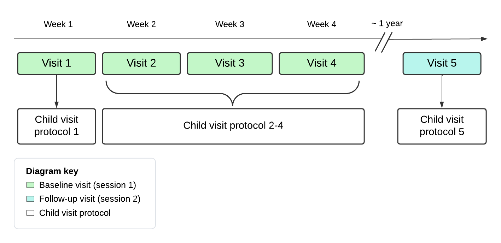

<!-- omit in toc -->
# Data Manual - Study REACH

- [Introduction](#introduction)
  - [Overview of Study](#overview-of-study)
- [Study Design](#study-design)
  - [Baseline visits (session 1)](#baseline-visits-session-1)
    - [Child Visit Protocol 1 (visit 1)](#child-visit-protocol-1-visit-1)
    - [Child Visit Protocol 2](#child-visit-protocol-2)
    - [Child Visit Protocol 3](#child-visit-protocol-3)
    - [Child Visit Protocol 4](#child-visit-protocol-4)
  - [Follow-up visit (session 2)](#follow-up-visit-session-2)
    - [Child Visit Protocol 5 (Visit 5)](#child-visit-protocol-5-visit-5)
- [Outcome Measures: Descriptions and Protocols](#outcome-measures-descriptions-and-protocols)
  - [Laboratory Eating Paradigms](#laboratory-eating-paradigms)
    - [Test Meal](#test-meal)
    - [Eating in the Absence of Hunger](#eating-in-the-absence-of-hunger)
      - [EAH wanting questionnaire](#eah-wanting-questionnaire)
  - [Fullness](#fullness)
  - [Anthropometrics](#anthropometrics)
    - [Height and Weight](#height-and-weight)
    - [Dual-Energy X-Ray Absorptiometry (DXA)](#dual-energy-x-ray-absorptiometry-dxa)
  - [Actigraphy](#actigraphy)
  - [Behavioral tasks](#behavioral-tasks)
    - [Reward-Related Decision-Making (Space Game)](#reward-related-decision-making-space-game)
    - [Relative Reinforcing Value Task (RRV)](#relative-reinforcing-value-task-rrv)
    - [Pavlovian-to-Instrumental Transfer Task (PIT)](#pavlovian-to-instrumental-transfer-task-pit)
  - [MRI protocol](#mri-protocol)
    - [Mock-Scan Protocol](#mock-scan-protocol)
    - [State Anxiety Ratings (CAMS)](#state-anxiety-ratings-cams)
    - [Structural scan](#structural-scan)
    - [Functional scans - Food View Task](#functional-scans---food-view-task)
      - [Data and meta-data:](#data-and-meta-data)
    - [Functional Scans - Stop Signal Task ("Plate Sorting Game")](#functional-scans---stop-signal-task-plate-sorting-game)
    - [Field maps](#field-maps)
    - [Post-scan fMRI behavioral assessment](#post-scan-fmri-behavioral-assessment)
  - [NIH toolbox](#nih-toolbox)
  - [WASI](#wasi)
  - [Child-Reported Questionnaires](#child-reported-questionnaires)
    - [Kid's Brand Awareness Survey (KBAS)](#kids-brand-awareness-survey-kbas)
    - [Child Screen Time Questionnaire (STQ)](#child-screen-time-questionnaire-stq)
    - [Loss of Control Eating Questionnaire (LOC)](#loss-of-control-eating-questionnaire-loc)
    - [Pictorial Personality Trains Questionnaire (PPTQ)](#pictorial-personality-trains-questionnaire-pptq)
    - [Stress in Children Questionnaire (SIC)](#stress-in-children-questionnaire-sic)
  - [Parent-Reported Questionnaires](#parent-reported-questionnaires)
    - [Visit 1 Demographics](#visit-1-demographics)
    - [Parent Household Demographics Questionnaire](#parent-household-demographics-questionnaire)
    - [Alcohol Use Disorders Identification Test (AUDIT)](#alcohol-use-disorders-identification-test-audit)
    - [Behavioral Inhibition System/Behavioral Activation System (BIS/BAS)](#behavioral-inhibition-systembehavioral-activation-system-bisbas)
    - [Behavioral Rating Inventory of Executive Function-2 (BRIEF-2)](#behavioral-rating-inventory-of-executive-function-2-brief-2)
    - [Binge Eating Scale (BES)](#binge-eating-scale-bes)
    - [Child Behavior Questionnaire (CBQ) - Short Form Version 1](#child-behavior-questionnaire-cbq---short-form-version-1)
    - [Children's Leisure Activities Study Survey (CLASS)](#childrens-leisure-activities-study-survey-class)
    - [Community Childhood Hunger Identification Project (CCHIP)](#community-childhood-hunger-identification-project-cchip)
    - [Child Feeding Quesstionnaire (CFQ)](#child-feeding-quesstionnaire-cfq)
    - [Children's Eating Behavior Quesstionnaire (CEBQ)](#childrens-eating-behavior-quesstionnaire-cebq)
    - [Children's Sleep Habits Questionnaire - Abreviated (CSHQ-A)](#childrens-sleep-habits-questionnaire---abreviated-cshq-a)
    - [Comprehensive Feeding Practices Questionnaire (CFPQ)](#comprehensive-feeding-practices-questionnaire-cfpq)
    - [Confusion, Hubbub, and Order Scale (CHAOS)](#confusion-hubbub-and-order-scale-chaos)
    - [Dutch Eating Behavior Questionnaire (DEBQ)](#dutch-eating-behavior-questionnaire-debq)
    - [External Food Cues Responsiveness Scale (EFCR)](#external-food-cues-responsiveness-scale-efcr)
    - [Feeding Strategies Questionnaire (FSQ)](#feeding-strategies-questionnaire-fsq)
    - [Fulkerson Home Food Inventory (FHFI)](#fulkerson-home-food-inventory-fhfi)
    - [Household Food Insecurity Access Scale (HFIAS)](#household-food-insecurity-access-scale-hfias)
    - [Household Food Security Survey Module (HFSSM)](#household-food-security-survey-module-hfssm)
    - [Lifestyle Behavior Checklist (LBC)](#lifestyle-behavior-checklist-lbc)
    - [Problematic Media Use Measure (PMUM)](#problematic-media-use-measure-pmum)
    - [Perceived Stress Scale (PSS)](#perceived-stress-scale-pss)
    - [Parental Strategies to Teach Children about Advertising (PSTCA)](#parental-strategies-to-teach-children-about-advertising-pstca)
    - [Parent Weight Loss Behavior Questionnaire (PWLB)](#parent-weight-loss-behavior-questionnaire-pwlb)
    - [Ranking Food Item Questionnaire (RANK)](#ranking-food-item-questionnaire-rank)
    - [Structure and Control in Parent Feeding (SCPF)](#structure-and-control-in-parent-feeding-scpf)
    - [Sensitivity to Punishment and Reward Questionnaire (SPSRQ)](#sensitivity-to-punishment-and-reward-questionnaire-spsrq)
    - [Three Factor Eating Questionnaire - Revised (TFEQ)](#three-factor-eating-questionnaire---revised-tfeq)
    - [US Household Food Security Survey Module: Three Stage (HFSSM)](#us-household-food-security-survey-module-three-stage-hfssm)
- [Using the data](#using-the-data)
  - [Locating the data you want](#locating-the-data-you-want)
  - [Using the data](#using-the-data-1)
    - [General usage notes](#general-usage-notes)
    - [Using phenotype data](#using-phenotype-data)
      - [Combining datasets](#combining-datasets)
    - [Using rawdata](#using-rawdata)
    - [Using derivative data](#using-derivative-data)
  - [Correcting data entry/collection errors](#correcting-data-entrycollection-errors)
- [Data Management](#data-management)
  - [Directory Organization](#directory-organization)
    - [untouchedRaw](#untouchedraw)
    - [bids](#bids)
    - [bids/sourcedata](#bidssourcedata)
    - [bids/rawdata](#bidsrawdata)
    - [bids/phenotype](#bidsphenotype)
    - [bids/derivatives](#bidsderivatives)
    - [bids/code](#bidscode)
  - [Data Processing Software](#data-processing-software)
    - [R01\_Marketing](#r01_marketing)
    - [dataREACHr](#datareachr)
    - [dataprepr](#dataprepr)
    - [dcm2bids](#dcm2bids)
    - [pydeface](#pydeface)
    - [mriqc](#mriqc)
    - [fmriprep](#fmriprep)
    - [afni](#afni)
  - [Data Processing Pipeline](#data-processing-pipeline)
    - [Overview](#overview)
    - [Required access](#required-access)
    - [Retriving data from the source](#retriving-data-from-the-source)
      - [Survey (redcap) data](#survey-redcap-data)
      - [Task data](#task-data)
      - [MRI data](#mri-data)
    - [MRI data processing example for subject 001](#mri-data-processing-example-for-subject-001)
    - [Explanation of MRI data processing steps](#explanation-of-mri-data-processing-steps)
    - [Organizing data into BIDS with processing scripts](#organizing-data-into-bids-with-processing-scripts)
      - [Survey and Task Data](#survey-and-task-data)
    - [Neuroimaging data](#neuroimaging-data)
      - [Example processing for sub 001](#example-processing-for-sub-001)
  - [Data Quality Control](#data-quality-control)
      - [Survey data](#survey-data)
      - [MRI data](#mri-data-1)
  - [Data Documentation](#data-documentation)
  - [Pre-Processing Pipeline](#pre-processing-pipeline)
    - [Pipeline Execution](#pipeline-execution)
      - [1) Raw Data](#1-raw-data)
        - [1a) Exporting](#1a-exporting)
        - [1b) Quality Control](#1b-quality-control)
      - [2) ...](#2-)
- [Interactive Reports and Tables](#interactive-reports-and-tables)
- [Analyses: Guidelines for Reproducibility and Documentation](#analyses-guidelines-for-reproducibility-and-documentation)


# Introduction

## Overview of Study

  
# Study Design

Study REACH involves a total of 5 visits for parent-child dyads (Figure 1). The first 4 visits occur ~1 week apart; these are referred to as baseline or session 1 ('ses-1') visits; the 5th visit occurs ~1 year after baseline; this visit is referred to as follow-up or session 2 ('ses-2').

The 4 baseline visits include: Child Visit Protocol 1, Child Visit Protocol 2, Child Visit Protocol 3, and Child Visit Protocol 4. Child Visit Protocol 1 always occurred on the first study visit, while Child Visit Protocols 2-4 could vary in order due to MRI availability. The follow-up visit includes Child Visit Protocol 5. 

Parents completed sets of questionnaires for each of the 5 visits. 


 \
Figure 1. Timeline of REACH visits and their associated child visit protocols. 

## Baseline visits (session 1)
### Child Visit Protocol 1 (visit 1)

The first visit takes place in Noll Lab. During the visit, the parent and child complete consent and assent, respectively. Child and parent [height and weight](#height-and-weight) are measured twice by a researcher and children complete a [Dual-Energy X-Ray Absorptiometry (DXA)](#dual-energy-x-ray-absorptiometry-dxa) scan. 
Children then complete the [test meal](#test-meal) protocol with the neutral advertisment condition. This test meal is recorded to code [meal microstructure](#). The children also rate their fullness using [Freddy Fullness](#) and [liking](#) and [wanting](#) of foods. Children complete the [NIH toolbox](#nih-toolbox) and [Relative Reinforceing Value task](#relative-reinforcing-value-task-rrv) and watch a [mock fMRI video](#mock-scan-protocol). Both parents and children also complete questionnaires on REDCap.

Child Measures:
* [Height and Weight](#height-and-weight)
* [Dual-Energy X-Ray Absorptiometry (DXA)](#dual-energy-x-ray-absorptiometry-dxa)
* [Test Meal](#test-meal)
* [Kid's Brand Awareness Survey](#kids-brand-awareness-survey-kbas)
* [Child Screen Time Questionnaire](#child-screen-time-questionnaire-stq)
* [NIH toolbox](#nih-toolbox)
* [Relative Reinforceing Value task](#relative-reinforcing-value-task-rrv)
* [Mock fMRI video](#mock-scan-protocol)

Parent Measures:
* [Height and Weight](#height-and-weight)
* [Visit 1 Demographics Questionnaire](#visit-1-demographics)
* [Parent Household Demographics Questionnaire](#parent-household-demographics-questionnaire)
* [Pubertal Development Scale](#)
* [Tanner Scale](#)
* [Child Feeding Questionnaire](#child-feeding-quesstionnaire-cfq)
* [Children's Eating Behavior Questionnaire](#childrens-eating-behavior-quesstionnaire-cebq)
* [External Food Cues Responsiveness Scale](#external-food-cues-responsiveness-scale-efcr)
* [Confusion, Hubbub, and Order Scale](#confusion-hubbub-and-order-scale-chaos)
* [Percieved Stress Scale](#perceived-stress-scale-pss)
* [Lifestyle Behavioral Checklist](#lifestyle-behavior-checklist-lbc)

### Child Visit Protocol 2

The second visit takes place in Chandlee Laboratory. Upon arrival, the children rate their [fullness](#fullness) to ensure they are in a neutral state prior to completing the (functional magnetic resonance imaging (fMRI) paradigm)[#]. If they rate their fullness below 25%, they are given a snack and then rate their fullness again. This is repeated one more time if fullness remains below 25% (i.e., maximum of 2 snacks administered). Then, children complete a practice run and 2 behavioral runs of the [Stop Signal Task)](#functional---stop-signal-task-plate-sorting-game) before heading to SLEIC's MRI suite. In the MRI suite, children complete a [mock fMRI scan](#mock-scan-protocol) and then rate their [fullness](#fullness) and [state anxiety](#) before entering the MRI for the [fMRI Protocol](#functional-magnetic-resonance-imaging). After the scan, children rate [state anxiety](#) again and are provided a snack (small pizza, bag of chips, apple juice; intake not measured). Lastely, chidren complete the [post-fMRI behavioral assessment](#post-scan-fmri-behavioral-assessment). Parents complete questionnaires on REDCap.

Child Measures:
* [State Anxiety Ratings (CAMS)](#state-anxiety-ratings-cams)
* [Stop signal task (beh and fmri)](#functional---stop-signal-task-plate-sorting-game)
* [Food view task (fmri)](#functional-scans---food-view-task)
* [Post-fMRI behavioral assessment](#post-scan-fmri-behavioral-assessment)

Parent Measures:
* [Children's Behavior Questionnaire](#child-behavior-questionnaire-cbq---short-form-version-1)
* [Behavior Rating Inventory of Executive Function](#behavioral-rating-inventory-of-executive-function-2-brief-2)
* [Children's Sleep Habit Questionnaire](#childrens-sleep-habits-questionnaire---abreviated-cshq-a)
* [Binge Eating Scale](#binge-eating-scale-bes)
* [Family Food Behavior Survey](#family-food-behvior-survey-ffbs)
* [Feeding Strategies Questionnaire](#feeding-strategies-questionnaire-fsq)

### Child Visit Protocol 3

The third visit takes place in Chandlee Laboratory.
and the ['Space Game'](#reinforcement-learning-space-game), which is a two-stage reinforcement learning task.

Child Measures:
* [Test Meal](#test-meal) following toy or food commerical exposure
* [EAH food wanting questionnaire](#)
* [Eating in the Absense of Hunger](#) following toy or food commerical exposure
* [Reward-Related Decision-Making Task](#reward-related-decision-making-space-game)

Parent Measures:
* [Children's Leisure Activities Study Survey](#childrens-leisure-activities-study-survey-class)
* [Sensitivity to Punishment/Sensitivity to Reward Questionnaire](#sensitivity-to-punishment-and-reward-questionnaire-spsrq)
* [Behavioral Inhibition System/Behavioral Activation System](#behavioral-inhibition-systembehavioral-activation-system-bisbas)
* [Parent Weight-Loss Beahvior Questionnaire](#parent-weight-loss-behavior-questionnaire-pwlb)
* [Three-Factor Eating Questionnaire](#three-factor-eating-questionnaire---revised-tfeq)
* [Parental Strategies to Teach Children about Advertising](#parental-strategies-to-teach-children-about-advertising-pstca)
* [Dutch Eating Behavior Questionnaire](#dutch-eating-behavior-questionnaire-debq)
* [Structure and Control in Parent Feeding Questionnaire](#structure-and-control-in-parent-feeding-scpf)

### Child Visit Protocol 4

Child Visit Protocol 4 takes place in Chandlee Laboratory. 

Child Measures:
* [Test Meal](#test-meal)
* [EAH food wanting questionnaire](#)
* [Eating in the Absense of Hunger](#)
* [Loss of Control Eating Questionnaire](#loss-of-control-eating-questionnaire-loc)
* [Pavlovian-to-Instrumental Transfer Task](#pavlovian-to-instrumental-transfer-task-pit)
* [Pictorial Personality Traits Questionnaire](#pictorial-personality-trains-questionnaire-pptq)
* [Stress in Children Questionnaire](#stress-in-children-questionnaire-stq)
* [WASI (IQ assessment)](#wasi)

Parent Measures:
* [Household Food Security Survey Module](#household-food-security-survey-module-hfssm)
* [Household Food Insecurity Access Scale](#household-food-insecurity-access-scale-hfias)
* [Problematic Media Use Measure](#problematic-media-use-measure-pmum)
* [Community Childhood Hunger Identification Project](#community-childhood-hunger-identification-project-cchip)
* [Alcohol Use Disorders Identification Test](#alcohol-use-disorders-identification-test-audit)
* [Fulkerson Home Food Inventory](#fulkerson-home-food-inventory-fhfi)
* [Comprehensive Feeding Practices Questionnaire](#comprehensive-feeding-practices-questionnaire-cfpq)

## Follow-up visit (session 2)
### Child Visit Protocol 5 (Visit 5)

The fifth visit takes place in Noll Laboratory 1 year after [Visit 1](#visit-1). 

Child Measures:
* [Height and Weight](#height-and-weight)
* [Dual-Energy X-Ray Absorptiometry (DXA)](#dual-energy-x-ray-absorptiometry-dxa)
* [TICTACH task](#)
* [Test Meal](#test-meal)
* [EAH food wanting questionnaire](#)
* [Eating in the Absense of Hunger](#)
* [Kid's Brand Awareness Survey](#kids-brand-awareness-survey-kbas)
* [Child Screen Time Questionnaire](#child-screen-time-questionnaire-stq)
* [Loss of Control Eating Questionnaire](#loss-of-control-eating-questionnaire-loc)
* [NIH toolbox](#nih-toolbox)
* [Puberty/Tanner](#)

Parent Measures:
* [Height and Weight](#height-and-weight)
* [Parent Household Demographics Questionnaire](#parent-household-demographics-questionnaire)
* [Pubertal Development Scale](#)
* [Tanner Scale](#)
* [Children's Eating Behavior Questionnaire](#childrens-eating-behavior-quesstionnaire-cebq)
* [Children's Behavior Questionnaire](#child-behavior-questionnaire-cbq---short-form-version-1)
* [Children's Sleep Habit Questionnaire](#childrens-sleep-habits-questionnaire---abreviated-cshq-a)
* [Children's Leisure Activities Study Survey](#childrens-leisure-activities-study-survey-class)
* [Parental Strategies to Teach Children about Advertising](#parental-strategies-to-teach-children-about-advertising-pstca)
* [Problematic Media Use Measure](#problematic-media-use-measure-pmum)
* [Alcohol Use Disorders Identification Test](#alcohol-use-disorders-identification-test-audit)
* [Comprehensive Feeding Practices Questionnaire](#comprehensive-feeding-practices-questionnaire-cfpq)

# Outcome Measures: Descriptions and Protocols

## Laboratory Eating Paradigms

### Test Meal

### Eating in the Absence of Hunger

#### EAH wanting questionnaire

## Fullness

150 mm visual analgue scale referred to as "Freddy Fullness." 

References:
* [Keller KL, Assur SA, Torres M, Lofink HE, Thornton JC, Faith MS, Kissileff HR. Potential of an analog scaling device for measuring fullness in children: development and preliminary testing. Appetite. 2006 Sep;47(2):233-43. doi: 10.1016/j.appet.2006.04.004. Epub 2006 Jul 7. PMID: 16828929.](https://pubmed.ncbi.nlm.nih.gov/16828929/)

## Anthropometrics

### Height and Weight
Height (m) and weight (kg) of the child and enrolled parent (parent1) are measured twice by a trained research at Noll Laboratory. The dual measurements are averaged to derive average height and weight for child and parent. Average measurements are used to calculate:
* Parent1 BMI (kg/m<sup>2</sup>)
* Child BMI (kg/m<sup>2</sup>)
* Child BMI percentile (CDC reference for age and sex)
* Child BMI z-score (CDC reference for age and sex)

Height and weight of the biological parent that does not attend the visit (parent2) are reported by parent1 in the [Parent Household Demographics Questionnaire](#parent-household-demographics-questionnaire). Parent1-reported height and weight of parent2 are used to calculated:
* Parent2 BMI

The sexes of parent1 and parent2 are used to generate the variables:
* Maternal BMI
* Paternal BMI
* Maternal BMI method (measured, report)
* Paternal BMI method (measured, report)

### Dual-Energy X-Ray Absorptiometry (DXA)

## Actigraphy

## Behavioral tasks

### Reward-Related Decision-Making (Space Game)

Theoretical background...(brief)

<!-- omit in toc -->
#### Task Design

Instructions…  
Design...  
Stim images...

<!-- omit in toc -->
#### Outcomes of Interest

General  

Decision-making model

### Relative Reinforcing Value Task (RRV)

Theoretical background...(brief)

<!-- omit in toc -->
#### Task Design

Instructions…  
Design...  
Stim images...

<!-- omit in toc -->
#### Outcomes of Interest

General  


### Pavlovian-to-Instrumental Transfer Task (PIT)

Theoretical background...(brief)

<!-- omit in toc -->
#### Task Design

Instructions…  
Design...  
Stim images...

<!-- omit in toc -->
#### Outcomes of Interest

General  


## MRI protocol

### Mock-Scan Protocol

* Video
* Mock-Scan protocol
 
### State Anxiety Ratings (CAMS)

Reference = 'Ersig AL, Kleiber C, McCarthy AM, Hanrahan K. Validation of a clinically useful measure of children's state anxiety before medical procedures. J Spec Pediatr Nurs. 2013 Oct;18(4):311-9. doi: 10.1111/jspn.12042. Epub 2013 Jun 25. PMID: 24094126; PMCID: PMC4282760.'),

### Structural scan

### Functional scans - Food View Task

The Food View Task was developed to characterize the effects of food (vs. toy) commercials on children’s neural processing of food-cues. During the task, children were presented with food images after viewing toy and food commercials. 


<!-- omit in toc -->
#### Task Design

The Food View Task was administered using [Matlab2018b and Psychtoolbox3]. 

The Food View Task included 4 functional MRI runs (~3.7 min each). Each run included 4 commercial blocks (2 food, 2 toy) and 4 food image blocks (2 high-ED, 2 low-ED). Commercial and food image blocks were presented in alternating order, always starting with a commercial block. Commercial blocks contained 2 commercials (~30 seconds total) and food image blocks contained 5 images (1.5 seconds each with 0.5s fixation following each image). Between blocks, a fixation cross was presented on the screen for 6-8 seconds (jittered). Within a run, toy and food commercial blocks were presented in alternating order. For each subject, 2 runs started with toy commercials and 2 started with food commericals; which runs these were varied by subject (counterbalanced?).


Within each run, 2 food image blocks contained high-ED foods and 2 contained low-ED foods. Therefore a 2 (after toy commercial, after food commercial) x 2 (high-ED foods, low-ED foods) design could be used to explore the effects of commercials on children’s neural processing of food-cues by energy density. 

Instructions…  
Design...  

Food images were selected from Dr. Jens Blechert's Food Pics database. Images were selected based on .... Categorized into High/Low ED based on ...

<!-- omit in toc -->
#### Outcome Metrics

<!-- omit in toc -->
#### Behavioral Metrics

#### Data and meta-data: 
  * Individual subject data:
    * bids/rawdata/*/
  * Summary databases:
    * bids/derivatives/beh_summary_databases/foodview_long_by_block.tsv and foodview_long_by_block.json
    * bids/derivatives/beh_summary_databases/foodview_long_by_cond.tsv and foodview_long_by_cond.json

  
### Functional Scans - Stop Signal Task ("Plate Sorting Game")

The stop-signal task (SST) assesses inhibitory control by measuring the latency of response inhibition. To assess the effects of food (vs. toy) commercials on inhibitory control, children performed rounds of the SST after viewing toy and food commercials. 

The SST was adapted from the implementation in (Verbruggen, Logan, & Stevens, 2008). For a thorough discussion of the theoretical basis for the race-horse model of response inhibition see (Verbruggen & Logan, 2009). The basic premise is that participants will first activate a go-response to a stimuli. After seeing the stop stimuli, they will activate a nogo-response. If they are successful in inhibiting the go-response, the nogo-response was faster. If they fail to inhibit the go-response, the nogo-response was too slow. In this task, inhibition can be measured by manipulating the delay of the stop signal using a step-like function to hold successful stopping at a .5 probability. 


<!-- omit in toc -->
#### Task Design

The SST was administered using [Matlab2018b and Psychtoolbox3]. 

SST blocks were administered under practice, behavioral, and fmri contexts. Each block included 36 event trials (10 stop trials and 26 go trials).

During each trial, a plate of food was presented with a triangle-folded napkin on either the left or right side of the plate (go stimulus; see Figure 1) [for 1500 ms with an inter-stimulus-interval of 50 ms (i.e., fixation) ??]. Children were asked to sort the plates according to which side of the plate the napkin was on and to press the left or right arrow keys when the napkin appeared on the left or right side of the plate, respectively. They were encouraged to respond as quickly as possible. On stop trials, the plate would get covered with a warmer dome (i.e., stop-signal; see Figure 1). Children were instructed not to respond when the dome appeared.  The warmer dome (i.e., stop-signal) was presented after a variable stop-signal delay (SSD) determined by a step-wise adaptive procedure which increased the SSD 50ms after each successful stop trial and reduced the SSD by 50 ms after each unsuccessful stop trial with the first SSD = 250 ms. This adaptive procedure maintained ~0.50 probability of successful response inhibition. The task parameters were based on specifications articulated by Verbruggen and colleagues (2019) for best practices in measuring stop-signal reaction time according to the theoretical racehorse model.

The practice context included an explanation of the task followed by 1 SST block. During the practice block, children recieved feedback after each trial [explanation]. 

During behavioral and fmri contexts, children completed runs which included 2 commerical and 2 SST blocks each. There were 2 behavioral runs and 6 fmri runs. Within a run, commercial and SST blocks were presented in alternating order, always starting with a commercial block. Within a run, commercials blocks were either all food or all toy commericals. Each commerical block contained 1 commerical (~15 seconds). During behavioral blocks only, the message ‘Faster’ was presented after SST trials when children responded slower than 1.5 standard deviations below their mean reaction time in practice (to prevent children from slowing throughout the task). Between behavioral runs, children were given the opportunity to take a break and were shown their average response time (e.g., ‘How Fast Were You?’), given encouragement for how quickly the were responding (e.g., ‘Wow, that is faster than a second’), and were reminded not to press the arrow keys if the dome covered the plate.  

Stim images...

<!-- omit in toc -->
#### Outcomes of Interest

<!-- omit in toc -->
#### Outcome Metrics

### Field maps

### Post-scan fMRI behavioral assessment

## NIH toolbox

## WASI

## Child-Reported Questionnaires

All child questionnaires were administered by a trained research assistant using REDCap. The research assistant read all questions to children and children responded by indicating their answers verbally or by pointing at a selection on the computer screen.


### Kid's Brand Awareness Survey (KBAS)

The KBAS is 50-item, child-report measure, where children are asked to match the correct picture with food and toy logos. Two versions of the survey were administered (counterbalanced) which varied by category (food, toy) order. The KBAS was developed in the Keller Lab for Project REACH. 

<!-- omit in toc -->
#### Scale: 

<!-- omit in toc -->
#### Subscales:
  * Toy score
  * Food score

<!-- omit in toc -->
#### Scoring
Correctly matched items are scored as a 1. Incorrectly matched items are scored as a 0. The number of correct responses are determined within a category. Scoring was implemented in REDCap.

<!-- omit in toc -->
#### Database and meta-data in bids/phenotype: 
  * kbas.tsv and kbas.json


### Child Screen Time Questionnaire (STQ)

The STQ is a 17-item survey to assess screen time utilization in children across different modalities (e.g., TV, phones, video games). It was developed for Study REACH by the Keller Lab based on the ABCD Youth Screen Time survey


<!-- omit in toc -->
#### Scale:
Items used 1 of 2 scales:

Items 1-14:
0) None
1) < 30 minutes
2) 30 minutes
3) 1 hour
4) 2 hours
5) 3 hours
6) 4+ hours

Items 15-17:
0) Never
1) Once in a while
2) Regularly
3) All the time

<!-- omit in toc -->
#### Scoring: 
Not implemented 

<!-- omit in toc -->
#### Database and Code Book/Dictionairy: 
  * stq.tsv and stq.json

<!-- omit in toc -->
#### References:
* [ABCD Youth Screen Time Survey](https://nda.nih.gov/data-structure/abcd_stq01)

### Loss of Control Eating Questionnaire (LOC)

description...

<!-- omit in toc -->
#### Scale:

<!-- omit in toc -->
#### Scoring: 


<!-- omit in toc -->
#### Database and Code Book/Dictionairy: 
  * loc.tsv and loc.json

<!-- omit in toc -->
#### References:
* [Tanofsky-Kraff, M., Marcus, M. D., Yanovski, S. Z., and Yanovski, J. A. (2008). Loss of control eating disorder in children age 12 years and younger: Proposed research criteria. Eating Behaviors 9, 360-365. doi: 10.1016/j.eatbeh.2008.03.002.](https://pubmed.ncbi.nlm.nih.gov/18549996/)

### Pictorial Personality Trains Questionnaire (PPTQ)

The PPTQ is a 15-item questionnaire for measuring personality traits in children. For each item, children are asked to select from images the represent behaviors indicative of personality traits.

<!-- omit in toc -->
#### Raw data scale
The PPTQ was adminisered using the 3-point scale for younger children (6-9 years old):
1) Left image option
2) Middle image option ("It depends")
3) Right image option 

<!-- omit in toc -->
#### Subscales: 
| Subscale | Items |
| -------- | ------- | 
| extraversion | 1, 6*, 11|
| neuroticism | 2*, 7, 12* |
| openness to experience | 3, 8*, 13 |
| conscientiousness | 4*, 9, 14* |
| agreeableness | 5, 10*, 15 |
* *reverse-scored items

<!-- omit in toc -->
#### Scoring
Reverse scoring is implemented for reverse-scored items. The sum of responses is computed for each subscale if there are no missing responses. Scoring is implemented using [dataprepr](#dataprepr). 

<!-- omit in toc -->
#### Database and meta-data in bids/phenotype: 
  * pptq.tsv and pptq.json

<!-- omit in toc -->
#### References:
[Maćkiewicz M, Cieciuch J. Pictorial Personality Traits Questionnaire for Children (PPTQ-C)-A New Measure of Children's Personality Traits. Front Psychol. 2016 Apr 14;7:498. doi: 10.3389/fpsyg.2016.00498. PMID: 27252661; PMCID: PMC4879772.](https://www.ncbi.nlm.nih.gov/pmc/articles/PMC4879772/)

### Stress in Children Questionnaire (SIC)

The SIC is a self-rating questionnaire to assess stress in children.

<!-- omit in toc -->
#### Raw data scale:

0) Never
1) Sometimes
2) Often
3) Very Often
  
<!-- omit in toc -->
#### Subscales:
  * Lack of Well being
  * Distress
  * Lack of Social Support
  * Total score (grand mean)

<!-- omit in toc -->
#### Scoring (not implemented): 
[Responses are scaled to base 1 (i.e., 1-4) ... Scoring was implemented using [dataprepr](#dataprepr).]

<!-- omit in toc -->
#### Database and meta-data in bids/phenotype: 
  * sic.tsv and sic.json

References: [Osika W, Friberg P, Wahrborg P. A new short self-rating questionnaire to assess stress in children. Int J Behav Med. 2007;14(2):108-117. doi:10.1007/BF03004176](https://link.springer.com/article/10.1007/BF03004176)

## Parent-Reported Questionnaires

All parent questionnaires were administered using REDCap.

### Visit 1 Demographics

The Visit 1 Demographics form assesses child demographics and items related to birth and infancy (e.g., birth weight, infant feeding practices). This questionnaire was developed within the Keller Lab for Study REACH.

Items from this questionnaire are reported in 2 databases in bids/phenotype: 
  * Child demographic variables (race, ethnicity) are reported in:
    * demographics.tsv and demographics.json
  * Items related to birth and infancy are reported in:
    * infancy.tsv and infancy.json

### Parent Household Demographics Questionnaire

The Parent Household Demographics Questionnaire assesses parent demographics and the household environment. This questionnaire was developed within the Keller Lab for Study REACH.

<!-- omit in toc -->
#### Database and meta-data in bids/phenotype: 
  * household.tsv and household.json

Items from this questionnaire that are commonly reported in papers or used as covariates (i.e., maternal education, family income) have also been included in demographics.tsv and demographics.json.

### Alcohol Use Disorders Identification Test (AUDIT)

The Alcohol Use Disorders Identification Test (AUDIT) is a 10-item screening instrument for hazardous and/or harmful alcohol consumption. A score of 8 or more indicates a strong likelihood of harmful alcohol consumption.

<!-- omit in toc -->
#### Scale
Most questions used the stated scale with alternative responses of equal weight in parentheses:

0) Never (1-2 drinks; No)
1) Less than Monthly (Monthly or Less; 3 or 4 drinks)
2) Monthly (2-4 Times a Month; 5 or 6 drinks; Yes, but not in the last year)
3) Weekly (2-3 Times a Week; 7 to 9 drinks)
4) Daily or Almost Daily (4 or More Times a Week; 10 or more drinks; Yes, during the last year)

Note: 2 items (9 and 10) use the scale 0, 2, 4 (i.e., 1 and 3 are not included).

<!-- omit in toc -->
#### Outcome Measures:
* Total Score
* Category (Not Harmful Consumtion, Likely Harmful Consumption)

<!-- omit in toc -->
#### Scoring
The sum of responses is computed if there are no missing responses. Scores >= 8 are categorized as "Likely Harmful Consumption" while scores <8 are categorized as "Not Harmful Consumtion". Scoring is implemented using [dataprepr](#dataprepr). 

<!-- omit in toc -->
#### Database and meta-data in bids/phenotype: 
  * audit.tsv and audit.json
  
<!-- omit in toc -->
#### References:
* [Saunders JB, Aasland OG, Babor TF, De La Fuente JR, Grant M. Development of the Alcohol Use Disorders Identification Test (AUDIT): WHO Collaborative Project on Early Detection of Persons with Harmful Alcohol Consumption-II. Addiction. 1993;88(6):791-804. doi:10.1111/j.1360-0443.1993.tb02093.x](https://pubmed.ncbi.nlm.nih.gov/8329970/)

### Behavioral Inhibition System/Behavioral Activation System (BIS/BAS)

The BIS/BAS scale assesses 2 motivational systems proposed to underlie behavior and affect: a behavioral inhibition system (BIS) and a behavioral activation system (BAS). The scale contains 20 scored items and 4 filler items. Parents completed a parent-report version using a 4-point likert scale to assess child BIS/BAS sensitivity.


<!-- omit in toc -->
#### Raw data scale:

0) Very True for Me
1) Somewhat True for Me
2) Somewhat False for Me
3) Very False for Me

<!-- omit in toc -->
#### Subscales / Outcome measures:
| Subscale | Items* |
| -------- | ------- | 
| Behavioral Inhibition System (BIS) | 16*, 24*, 8*, 13*, 2, 19*, 22|
| BAS Funseeking | 10*, 20*, 5*, 15*|
| BAS Drive | 9*, 3*, 12*, 21* |
| BAS Reward Responsiveness | 7*, 4*, 18*, 23*, 14*|
| Behavioral Activation System (BAS) | Funseeking, Drive, and Reward Responsiveness items|
* *reverse-scored item

Note, in the literature, different versions of the BIS/BAS use different and opposing scoring scales (e.g., higher scores indicate disagreement vs agreement). The direction of the scale used here is consistent in direction with Carver et al., and Blair et al., but not Muris et al. [Documentation from the University of Washington](https://depts.washington.edu/uwcssc/sites/default/files//hw00/d40/uwcssc/sites/default/files/BIS-BAS.pdf) suggests this version of the scale should be scored by reverse-scoring all items except 2 and 22, which is seeminly different that reported by Carver, but makes more sense intuitively (e.g., such that higher BIS scores indicate higher behavioral inhibition sensitivity).

<!-- omit in toc -->
#### Scoring:
Responses are scaled to base 1 (i.e., 1-4) and reverse scoring is implemented for reverse-scored items. The mean of scaled responses is computed for each subscale if there are no missing responses. Scoring is implemented using [dataprepr](#dataprepr). 

<!-- omit in toc -->
#### Database and meta-data in bids/phenotype: 
  * bisbas.tsv and bisbas.json
  
<!-- omit in toc -->
#### References:
* Original Scale for adults: [Carver CS, White TL. Behavioral inhibition, behavioral activation, and affective responses to impending reward and punishment: The BIS/BAS Scales. Journal of Personality and Social Psychology. 1994;67(2):319-333. doi:http://dx.doi.org/10.1037/0022-3514.67.2.319.](https://psycnet.apa.org/doiLanding?doi=10.1037%2F0022-3514.67.2.319)
* Adapted parent-report scale (7-point likert): [Blair, C. (2003). Behavioral inhibition and behavioral activation in young children: Relations with self-regulation and adaptation to preschool in children attending head start. Developmental Psychobiology, 42(3), 301–311.](https://onlinelibrary.wiley.com/doi/10.1002/dev.10103)
* Adapted child-report scale (4-point likert): [Muris P, Meesters C, de Kanter E, Timmerman PE. Behavioural inhibition and behavioural activation system scales for children: relationships with Eysenck’s personality traits and psychopathological symptoms. Personality and Individual Differences. 2005;38(4):831-841. doi:10.1016/j.paid.2004.06.007](https://pure.eur.nl/en/publications/behavioural-inhibition-and-behavioural-activation-system-scales-f)

### Behavioral Rating Inventory of Executive Function-2 (BRIEF-2)

The Behavioral Rating Index of Executive Function-2 (BRIEF-2) is a parent-report measure of everyday executive behaviors in children ages 5-18 that is normed for age and gender. T-scores of 60 or greater indicate high risk/clinical relevance for symptoms. 

<!-- omit in toc -->
#### Raw data scale:

0) Never
1) Sometimes
2) Always

<!-- omit in toc -->
#### Subscales/Outcome measures:

| Subscale | Items |
| -------- | ------- | 
| Inhibit<sup>a</sup> | 1, 10, 16, 24, 30, 39, 48, 62 | 
| Self-Monitor<sup>a</sup> | 4, 13, 20, 26 | 
| Shift<sup>a</sup> | 2, 11, 17, 31, 40, 49, 58, 60 | 
| Emotional Control<sup>a</sup> | 6, 14, 22, 27, 34, 43, 51, 56 | 
| Initiate<sup>a</sup> | 9, 38, 50, 55, 61 | 
| Working Memory<sup>a</sup> | 3, 12, 19, 25, 28, 32, 41, 46 | 
| Plan/Organize<sup>a</sup> | 7, 15, 23, 35, 44, 52, 57, 59 | 
| Task-Monitor<sup>a</sup> | 5, 21, 29, 33, 42 | 
| Organization of Materials<sup>a</sup> | 8, 37, 45, 47, 53, 63 | 
| Behavioral Regulation Index<sup>b</sup> | Inhibit and Self-Monitor items | 
| Emotional Regulation Index<sup>b</sup> | Shift and Emotional Control items | 
| Cognitive Regulation Index<sup>b</sup> | Initiate, Working Memory, Plan/Organize, and Task-Monitor items | 
| Global Executive Composite<sup>b</sup> | All clinical scale items | 
| Inconsistency<sup>c</sup>| set A: 5, 9, 10, 17, 20, 22, 25, 37; set B: 21, 26, 40, 48, 50, 55, 56, 63 | 
| Negativity<sup>c</sup> | 14, 28, 30, 34, 39, 41, 58, 60 | 
| Infrequency<sup>c</sup> | 18, 36, 54 | 
* <sup>a</sup>Clinical Scales; <sup>b</sup>Executive Function indices and composite outcomes; <sup>c</sup>Indicators of response validity

<!-- omit in toc -->
#### Scoring
Responses are scaled to base 1 (i.e., 1-3). Raw scores are calculated as following:
* Clinical scales, indexes and global executive composite: the sum of responses for a subscale is computed if all responses were completed
* Inconsistency: the sum of absolute differences between the set A and set B subscale items
* Negativity: the number of subscale items that equal 3
* Infrequency: the number of subscale items > 1

Age and sex are used to determine subscale T-scores and percentiles from raw scores. Scoring is implemented using [dataprepr](#dataprepr). 


<!-- omit in toc -->
#### Database and meta-data in bids/phenotype: 
  * brief2.tsv and brief2.json
  
<!-- omit in toc -->
#### References:
* Gioia GA, Isquith PK, Guy SC, Kenworthy L. BRIEF-2: Behavior Rating Inventory of Executive Function: Professional Manual. Psychological Assessment Resources; 2015.
  
### Binge Eating Scale (BES)

Parent-report scale of child binge eating behaviors. The items in this questionnaire were adapted from Gormally et al., to ask about child behavior. 

<!-- omit in toc -->
#### Raw data scale
Items used a scale from 0-3 or 0-2, depending on the number of statements an item includes. 
999) Don't Want to Answer

<!-- omit in toc -->
#### Outcome Measures:
* Total Score

<!-- omit in toc -->
#### Scoring: 
The sum of the responses is computed if there are no missing or "Don't Want to Answer" responses. Scoring was implemented using [dataprepr](#dataprepr). 

<!-- omit in toc -->
#### Database and meta-data in bids/phenotype: 
  * bes.tsv and bes.json
  
<!-- omit in toc -->
#### References:
* [Gormally, J., Black, S., Daston, S., & Rardin, D. (1982). The assessment of binge eating severity among obese persons. Addictive Behaviors, 7(1), 47–55. https://doi.org/10.1016/0306-4603(82)90024-7](https://pubmed.ncbi.nlm.nih.gov/7080884/)
* Timmerman, G. M. (1999). Binge Eating Scale: Further Assessment of Validity and Reliability. Journal of Applied Biobehavioral Research, 4(1), 1–12. https://doi.org/10.1111/j.1751-9861.1999.tb00051.x


### Child Behavior Questionnaire (CBQ) - Short Form Version 1

The CBQ is a 94-item assessment of child temperament where parents rate statements from 'Extremely Untrue of Your Child' to 'Extremely True of Your Child'.

<!-- omit in toc -->
#### Raw Data Scale:

0) Extremely Untrue of Your Child
1) Quite Untrue of Your Child
2) Slightly Untrue of Your Child
3) Neither True nor False of Your Child
4) Slightly True of of Your Child
5) Quite True of of Your Child
6) Extremely True of Your Child
7) N/A

<!-- omit in toc -->
#### Subscales: 
| Subscale | Items |
| -------- | ------- | 
| Activity Level | 1, 12, 18*, 22, 50*, 85, 93* |
| Anger/Frustration | 2, 14, 30, 40, 61*, 87 |
| Approach/Positive Anticipation | 6, 15, 46, 58, 90*, 92*|
| Attentional Focusing | 16*, 21*, 62, 71, 84*, 89 |
| Discomfort | 3*, 9, 29, 49*, 64, 91*|
| Falling Reactivity/Soothability | 25*, 34*, 44, 59, 66, 75* |
| Fear | 17, 23, 35*, 41, 63, 68* |
| High Intesity Pleasure | 4, 10, 33, 69, 78*, 88|
| Impulsivity | 7, 28, 36*, 43*, 51, 82*|
| Inhibitory Control | 38, 45, 53*, 67, 73, 81|
| Low Intensity Pleasure | 26, 39, 57, 65, 72, 76, 86, 94|
| Perceptual Sensitivity | 5, 13, 24, 32, 47, 83* |
| Sadness | 8, 20, 27, 31, 54*, 56*, 74*|
| Shyness | 11*, 37, 42, 52, 60*, 70|
| Smiling and Laughter | 19*, 48*, 55, 77, 79, 80*|
| Big 3 Surgency | average of the scale scores for Activity Level, High-Intensity Pleasure, Impulsivity, and reverse-scored shyness |
| Big 3 Negative Affect | Average of the scale scores for Anger, Discomfort, Fear, Sadness, and Soothability-reversed |
| Big 3 Effortful Control | Average of the scale scores for Attention Focusing, Inhibitory Control, Low-Intesity Pleasure, and Perceptual Sensitivity |
* *reverse-scored items

<!-- omit in toc -->
#### Scoring
7's (N/A) are recoded as missing (NA). Responses are scaled to base 1 (i.e., 1-7). Reverse scoring is implemented for reverse-scored items. The mean of responses is computed for each subscale, ignoring skipped items. Scoring is implemented using [dataprepr](#dataprepr). 

<!-- omit in toc -->
#### Database and meta-data in bids/phenotype: 
  * cbq.tsv and cbq.json
  
<!-- omit in toc -->
#### References:
* [Putnam SP, Rothbart MK. Development of Short and Very Short Forms of the Children’s Behavior Questionnaire. Journal of Personality Assessment. 2006;87(1):102-112. doi:10.1207/s15327752jpa8701_09 doi.org/10.1097/00004703-200112000-00007](https://pubmed.ncbi.nlm.nih.gov/16856791/)
* [Rothbart MΚ, Ahadi SA, Hershey KL. Temperament and Social Behavior in Childhood. Merrill-Palmer Quarterly. 1994;40(1):21-39](https://www.jstor.org/stable/23087906)


### Children's Leisure Activities Study Survey (CLASS)

description...

<!-- omit in toc -->
#### Scale: 

<!-- omit in toc -->
#### Scoring: 

<!-- omit in toc -->
#### Subscales:

<!-- omit in toc -->
#### Database and Code Book/Dictionairy: 

<!-- omit in toc -->
#### References:

### Community Childhood Hunger Identification Project (CCHIP)

description...

<!-- omit in toc -->
#### Scale:

0) No
1) Yes

<!-- omit in toc -->
#### Outcome Measures:
* Total Score
* Categorical Score (Not Hungry, At Risk for Hunger, Hungry)

<!-- omit in toc -->
#### Scoring
The mean of the responses is computed if there are no missing responses. Only items 1, 5, 9, 13, 17, 21, 25, and 29 contribute to the total score.

<!-- omit in toc -->
#### Database and meta-data in bids/phenotype: 
  * cchip.tsv and cchip.json

References:
* Wehler CA, Scott RI, Anderson JJ. The community childhood hunger identification project: A model of domestic hunger—Demonstration project in Seattle, Washington. Journal of Nutrition Education. 1992;24(1):29S-35S. doi:10.1016/S0022-3182(12)80135-X

### Child Feeding Quesstionnaire (CFQ)

description...

<!-- omit in toc -->
#### Raw Data Scale: 
Response options differed based on section of the questionnaire

* Perceived Weight:

  0) Markedly Underweight
  1) Underweight
  2) Average
  3) Overweight 
  4) Markedly Overweight

* Child Weight Concerns: 
  
  0) Unconcerned
  1) Slightly Unconcerned
  2) Neutral
  3) Slightly Concerned
  4) Very Concerned
  <ol start="99">
  <li>N/A' (provided if the question asked about an age-range not applicable to the child)</li>
</ol>
  
* Restriction and Pressure to Eat: 

  0) Disagree
  1) Slightly Disagree
  2) Neutral
  3) Slightly Agree
  4) Agree

* Monitoring: 

  0) Never
  1) Rarely
  2) Sometimes
  3) Mostly
  4) Always

<!-- omit in toc -->
#### Subscales:
| Subscale | Items |
| -------- | ------- | 
| Perceived Responsibility | 1-3 |
| Perceived Parent Weight | 4-7 |
| Perceived Child Weight^ | 8-12 |
| Child Weight Concerns | 14-16 |
| Restriction | 17-24 |
| Pressure to Eat | 25-28 |
| Monitoring | 29-31 |

<!-- omit in toc -->
#### Scoring: 
Responses are scaled to base 1 (i.e., 1-5). For the Perceived Child Weight subscale, the mean of the responses is computed ignoring missing or N/A responses. For all other subscales, the mean of the responses is computed if there are no missing responses. Scoring is implemented using [dataprepr](#dataprepr). 

<!-- omit in toc -->
#### Database and meta-data in bids/phenotype: 
  * cfq.tsv and cfq.json
  
<!-- omit in toc -->
#### References:
* [Birch, L. L., Fisher, J. O., Grimm-Thomas, K., Markey, C. N., Sawyer, R., & Johnson, S. L. (2001). Confirmatory factor analysis of the Child Feeding Questionnaire: A measure of parental attitudes, beliefs and practices about child feeding and obesity proneness. Appetite, 36(3), 201–210. https://doi.org/10.1006/appe.2001.0398](https://pubmed.ncbi.nlm.nih.gov/11358344/)


### Children's Eating Behavior Quesstionnaire (CEBQ)

description...

<!-- omit in toc -->
#### Scale: 

0) Never
1) Rarely
2) Sometimes
3) Often
4) Always

<!-- omit in toc -->
#### Subscales/Outcome Measures:

| Subscale | Items |
| -------- | ------- | 
| Food Responsiveness (FR) | 12, 14, 19, 28, 34 |
| Emotional Overeating (EOE) | 2, 13, 15, 27 |
| Enjoyment of Food (EF) | 1, 5, 20, 22 |
| Desire to Drink (DD) | 6, 29, 31 |
| Satiety Responsiveness (SR) | 3*, 17, 21, 26, 30 |
| Slowness in Eating (SE) | 4*, 8, 18, 35 |
| Emotional Undereating (EUE) | 9, 11, 23, 25 |
| Food Fussiness (FF)| 7, 10*, 16*, 24, 32*, 33 |
| Approach Behaviors | items in FR, EOE, EF, DD subscales |
| Avoidant Behaviors | items in SR, SE, EUE, FF subscales |
| Reward-based eating^ | 1, 3*, 4*, 5, 8*, 12, 14, 19, 20, 22, 28, 34 |
| Picky Eating^ | 7, 10, 16, 24, 32, 33 |
| Emotional eating^ | 2, 9, 13, 15, 23, 25 |
* *reverse-scored item; ^Manzano 3-factor subscale

<!-- omit in toc -->
#### Scoring
Responses are scaled to base 1 (i.e., 1-5). Reverse scoring is implemented for reverse-scored items. The mean of the scaled responses is computed for each subscale if there are no missing responses. Scoring is implemented using [dataprepr](#dataprepr). 

<!-- omit in toc -->
#### Database and meta-data in bids/phenotype: 
  * cebq.tsv and cebq.json
  
<!-- omit in toc -->
#### References:
* [Wardle, J., Guthrie, C. A., Sanderson, S., & Rapoport, L. (2001). Development of the children’s eating behaviour questionnaire. Journal of Child Psychology and Psychiatry, 42, 963–970. https://doi.org/10.1017/S0021963001007727](https://pubmed.ncbi.nlm.nih.gov/11693591/)
* [Manzano MA, Strong DR, Kang Sim DE, Rhee KE, Boutelle KN. Psychometric properties of the Child Eating Behavior Questionnaire (CEBQ) in school age children with overweight and obesity: A proposed three‐factor structure. Pediatric Obesity. 2021;16(10):e12795. doi:10.1111/ijpo.12795')](https://onlinelibrary.wiley.com/doi/abs/10.1111/ijpo.12795)

### Children's Sleep Habits Questionnaire - Abreviated (CSHQ-A)

description...

<!-- omit in toc -->
#### Scale: 
1) Never
2) Rarely
3) Sometimes
4) Usually
5) Always

<!-- omit in toc -->
#### Subscales:
* Bedtime Resistance
* Sleep Onset Delay
* Sleep Duration
* Sleep Anxiety
* Night Wakings
* Parasomnias
* Sleep Disordered Breathing
* Total

<!-- omit in toc -->
#### Scoring: 
The mean of the responses is computed if there are no missing responses. 
* The last section of the abreviated version of this scale was not administered (questions 19-22) so we are unable to use the reference cutoff for total score and we do not have the Daytime Sleepness subscale
* We are still resolving subscale scoring as it is unclear which subscale the following items correspond to: 5, 6, 16, and 20

<!-- omit in toc -->
#### Database and meta-data in bids/phenotype: 
  * cshq.tsv and cshq.json

<!-- omit in toc -->
#### References:
* [Owens, J. A., Spirito, A., & McGuinn, M. (2000). The Children’s Sleep Habits Questionnaire (CSHQ): Psychometric Properties of A Survey Instrument for School-Aged Children. SLEEP, 23(8), 1043–1052.](https://pubmed.ncbi.nlm.nih.gov/11145319/)
* [Chawla, J. K., Howard, A., Burgess, S., & Heussler, H. (2021). Sleep problems in Australian children with Down syndrome: The need for greater awareness. Sleep Medicine, 78, 81–87. https://doi.org/10.1016/j.sleep.2020.12.022](https://pubmed.ncbi.nlm.nih.gov/33412456/)


### Comprehensive Feeding Practices Questionnaire (CFPQ)

description...

<!-- omit in toc -->
#### Raw data scale: 
0) Never
1) Rarely
2) Sometimes
3) Mostly
4) Always

<!-- omit in toc -->
#### Subscales:

| Subscale | Items |
| -------- | ------- | 
| Child control | 5, 6, 10, 11, 12 |
| Emotion Regulation | 7, 8, 9 |
| Encourage balance and variety | 13, 24, 26, 38 |
| Environment | 14, 16*, 22, 37* |
| Food as reward | 23, 36, 19 |
| Involvement | 15, 20, 32 |
| Modeling | 44, 46, 47, 48 |
| Monitoring | 1, 2, 3, 4 |
| Pressure | 17, 30, 39, 49 |
| Restriction for health | 21, 28, 40, 43 |
| Restriction for weight control | 18, 27, 29, 33, 34, 35, 41, 45|
| Teaching about nutrition | 25, 31, 42*|
* *reverse-scored item

<!-- omit in toc -->
#### Scoring
Response are scaled to base 1 (i.e., 1-5). Reverse scoring is implemented for reverse-scored items. The mean of the scaled responses is computed for each subscale if there are no missing responses. Scoring is implemented using [dataprepr](#dataprepr). 

<!-- omit in toc -->
#### Database and meta-data in bids/phenotype: 
  * cfpq.tsv and cfpq.json

References: 
* [Musher-Eizenman, D., Holub. S., Comprehensive Feeding Practices Questionnaire: Validation of a New Measure of Parental Feeding Practices, Journal of Pediatric Psychology, 32, 8, 2007, Pages 960-972]()

### Confusion, Hubbub, and Order Scale (CHAOS)

description...

<!-- omit in toc -->
#### Raw data scale: 
0) Very much like your own home
1) Somewhat like your own home
2) A little like your own home
3) Not at all like your own home

<!-- omit in toc -->
#### Subscales:
* Total score

<!-- omit in toc -->
#### Scoring: 
Response are scaled to base 1 (i.e., 1-4). The sum of scaled responses is calculated is there are no missing responses. Scoring is implemented using [dataprepr](#dataprepr). 
 
<!-- omit in toc -->
#### Database and meta-data in bids/phenotype: 
  * chaos.tsv and chaos.json

<!-- omit in toc -->
#### References:
* [Matheny, A. P., Jr., Wachs, T. D., Ludwig, J. L., Phillips, K. (1995). Bringing order out of chaos: Psychometric characteristics of the confusion, hubbub, and order scale. Journal of Applied Developmental Psychology, 16(3), 429-444]()

### Dutch Eating Behavior Questionnaire (DEBQ)

description...

<!-- omit in toc -->
#### Raw data scale: 
0) Never
1) Seldom
2) Sometimes
3) Often
4) Very Often

<!-- omit in toc -->
#### Subscales:
| Subscale | Items | 
| -------- | ------- | 
| Emotional eating | 1, 3, 5, 8, 10, 13, 16, 20, 23, 25, 28, 30, 32|
| External eating | 2, 6, 9, 12, 15, 18, 21, 24, 27, 33|
| Restrained eating | 4, 7, 11, 14, 17, 19, 22, 26, 29, 31 |
* Note: unlike the original Dutch version of the DEBQ (van Strien et al., 1986), the English version (Wardle, 1987) does not require reverse scoring of item 21. Thus, item 21 was not reverse scored. 

<!-- omit in toc -->
#### Scoring: 
Response are scaled to base 1 (i.e., 1-5). The mean of the scaled responses is computed for each subscale if there are no missing responses. Scoring is implemented using [dataprepr](#dataprepr). 


<!-- omit in toc -->
#### Database and meta-data in bids/phenotype: 
  * debq.tsv and debq.json

<!-- omit in toc -->
#### References:
* [Wardle J. Eating style: a validation study of the Dutch Eating Behaviour Questionnaire in normal subjects and women with eating disorders. J Psychosom Res. 1987;31(2):161-9. doi: 10.1016/0022-3999(87)90072-9. PMID: 3473234.](https://pubmed.ncbi.nlm.nih.gov/3473234/)

### External Food Cues Responsiveness Scale (EFCR)

The EFCR is a parent-reported scale to measure external food cue responsiveness in pre-school children. It was developed using a sample of parents with children ages 2-5 years old.

<!-- omit in toc -->
#### Raw data scale: 
0) Never
1) Rarely
2) Sometimes
3) Often
4) Always

<!-- omit in toc -->
#### Scoring: 
Response are scaled to base 1 (i.e., 1-5). The mean of the scaled responses is computed if there are no missing responses. Scoring is implemented using [dataprepr](#dataprepr). 

<!-- omit in toc -->
#### Subscales:
* Total score

<!-- omit in toc -->
#### Database and meta-data in bids/phenotype: 
  * efcr.tsv and ecfr.json

<!-- omit in toc -->
#### References:
* [Masterson TD, Gilbert-Diamond D, Lansigan RK, Kim SJ, Schiffelbein JE, Emond JA. Measurement of external food cue responsiveness in preschool-age children: Preliminary evidence for the use of the external food cue responsiveness scale. Appetite. 2019;139:119-126. doi:10.1016/j.appet.2019.04.024'](https://pubmed.ncbi.nlm.nih.gov/31047939/)


### Feeding Strategies Questionnaire (FSQ)

description...

<!-- omit in toc -->
#### Scale: 
Responses were collected using a sliding scale with the anchors:
* 0 = Never
* 50 = Sometimes*
* 100 = Always 

<!-- omit in toc -->
#### Subscales:

<!-- omit in toc -->
#### Scoring: 

<!-- omit in toc -->
#### Database and meta-data in bids/phenotype: 
  * fsq.tsv and fsq.json

<!-- omit in toc -->
#### References:

### Fulkerson Home Food Inventory (FHFI)

description...

<!-- omit in toc -->
#### Scale: 

<!-- omit in toc -->
#### Scoring: 

<!-- omit in toc -->
#### Subscales:

<!-- omit in toc -->
#### Database and meta-data in bids/phenotype: 
  * fhfi.tsv and fhfi.json

<!-- omit in toc -->
#### References:

### Household Food Insecurity Access Scale (HFIAS)

description...

<!-- omit in toc -->
#### Raw data scales: 
The scale differed depending on the item:

* Event scale (Items asking if event occured):
  0) No 
  1) Yes
  -99) I don't know or Don't want to answer 

* Frequency scale (Items asking about frequency of event; administered only if responder indicated event occured):
  0) Rarely
  1) Sometimes
  2) Often

<!-- omit in toc -->
#### Outcome Measures:

| Outcome measure | Items | 
| -------- | ------- | 
| Total Score | Frequency items 1-9 |
| Category Score | Frequeny items 1-9 |
| Anxiety domain indicator | Event item 1 |
| Insufficient Quality domain indicator | Event item 2, 3, 4 |
| Insufficient food intake and physical consequences domain indicator | Event item 5, 6, 7, 8, 9 |

<!-- omit in toc -->
#### Scoring: 
The value of unadminiseted Frequency items (i.e., corresponding event did not occur) are set to 0 (Rarely). The sum of the responses to Frequency items is computed if there are no missing responses (total score). Category score is determined based on responses to indiviudal Frequency items.  Indicator values are set to 1 if any Event item occured (value = 1) for a given domain. Scoring is implemented using [dataprepr](#dataprepr). 

<!-- omit in toc -->
#### Database and meta-data in bids/phenotype: 
  * hfias.tsv and hfias.json

<!-- omit in toc -->
#### References:
* Bickel G, Nord M, Price C, Hamilton W, Cook J, others. Guide to measuring household food security, revised 2000. US Department of Agriculture, Food and Nutrition Service.
* Nord M. Measuring Children’s Food Security in US Households, 1995-99. US Department of Agriculture, Economic Research Service; 2002.


### Household Food Security Survey Module (HFSSM)

description...

<!-- omit in toc -->
#### Scale: 

<!-- omit in toc -->
#### Outcome measures:
* U.S. Household Food Security Scale score
* U.S. Household Food Security Scale category
* U.S. Adult Food Security Scale score
* U.S. Adult Food Security Scale category
* Six-Item Food Security Scale score
* Six-Item Food Security Scale category
* U.S. Children's Food Security Scale score
* U.S. Children's Food Security Scale category

<!-- omit in toc -->
#### Scoring: 

<!-- omit in toc -->
#### Database and meta-data in bids/phenotype: 
  * hfssm.tsv and hfssm.json

<!-- omit in toc -->
#### References:
* [U.S. HOUSEHOLD FOOD SECURITY SURVEY MODULE: THREE-STAGE DESIGN, WITH SCREENERS Economic Research Service, USDA September 2012](https://www.ers.usda.gov/media/8271/hh2012.pdf)

### Lifestyle Behavior Checklist (LBC)

The LBC is a questionnaire to assess child weight-related behaviour problems and parents' confidence in managing these behaviours. It contains 2 scales: (1) a Problem Scale which assesses the extent to which certain behaviors have been a problem and (2) a Confidence Scale which assesses how confident the responder is in dealing with a problem.

The original scale included 26 concerns parents might have about children's behavior and 2 optional open-ended items; one of conerns ("Item 11. Behaves disruptively at mealtime") and the 2 optional items did not differ between groups with HW and OB, so the authors suggested these items could be omitted from the questionnaire. 

Compared to the revised 24-item version from which a 4-factor subscale solution was derived, the 25-item version excludes item 20. REACH used the 25-item version. 

<!-- omit in toc -->
#### Scale: 
Scales differ for Problem Scale and Confidence Scale items: 

Problem Scale items use an integer scale from 0-6 with the anchors:
* 0 = Not much at all
* 3 = Somewhat
* 6 = Very much

Confidence Scale items use an integer scale from 0-9 with the anchors:
* 0 = Certain I cannot do it
* 9 = Certain I can do it

<!-- omit in toc -->
#### Subscales/outcome measures:
| Subscale | Items | 
| -------- | ------- | 
| Food-related misbehavior | 3-6, 8, 10, 11|
| Overeating | 1, 2, 9, 12-15 |
| Emotion related to being overweight | 21-25 |
| Physical activity | 7, 16-19|
| Total Problem score | |
| Total Confidence score | |

Note: The 4-factor subscales was developed using a 24-item questionnaire, which excluded item 20 (West et al. 2010).

<!-- omit in toc -->
#### Scoring
Only Problem Scale items are used in scoring. Response are scaled to base 1 (i.e., 1-7). The mean of the scaled responses is computed for each subscale if there are no missing responses. Scoring is implemented using [dataprepr](#dataprepr). 

<!-- omit in toc -->
#### Database and meta-data in bids/phenotype: 
  * lbc.tsv and lbc.json

<!-- omit in toc -->
#### References:
* [West F, Morawska A, Joughin K. The Lifestyle Behaviour Checklist: evaluation of the factor structure. Child: Care, Health and Development. 2010;36(4):508-515. doi:10.1111/j.1365-2214.2010.01074.x](https://pubmed.ncbi.nlm.nih.gov/20337641/)

### Problematic Media Use Measure (PMUM)

description...

<!-- omit in toc -->
#### Raw data scale: 

0) Never
1) Rarely
2) Sometimes
3) Often
4) Always

<!-- omit in toc -->
#### Outcome measures:
* total score 

<!-- omit in toc -->
#### Scoring
Response are scaled to base 1 (i.e., 1-5). The mean of the scaled responses is computed if there are no missing responses. Scoring is implemented using [dataprepr](#dataprepr). 

<!-- omit in toc -->
#### Database and meta-data in bids/phenotype: 
  * pmum.tsv and pmum.json

<!-- omit in toc -->
#### References:

### Perceived Stress Scale (PSS)

description...

Higher total scores reflect higher percieved stress; 

<!-- omit in toc -->
#### Raw data scale: 

0) Never
1) Almost never
2) Sometimes
3) Fairly Often
4) Very Always

<!-- omit in toc -->
#### Outcome measures/subscales:
| Subscale | Items | 
| -------- | ------- | 
| Total perceived stress score | 1, 2, 3, 4*, 5*, 6, 7*, 8*, 9, 10|
| Perceived helplessness | 1, 2, 3, 6, 9, 10  |
| Perceived self-efficacy | 4, 5, 7, 8 |
* *reverse-scored item

<!-- omit in toc -->
#### Scoring: 

<!-- omit in toc -->
#### Database and meta-data in bids/phenotype: 
  * pss.tsv and pss.json

<!-- omit in toc -->
#### References:
* [Cohen, S. and Williamson, G. Perceived Stress in a Probability Sample of the United States. Spacapan, S. and Oskamp, S. (Eds.) The Social Psychology of Health. Newbury Park, CA: Sage, 1988](https://psycnet.apa.org/record/1988-98838-002)
* [Taylor JM. Psychometric analysis of the Ten-Item Perceived Stress Scale. Psychol Assess. 2015 Mar;27(1):90-101. doi: 10.1037/a0038100. Epub 2014 Oct 27. PMID: 25346996.](#)

### Parental Strategies to Teach Children about Advertising (PSTCA)

description...

<!-- omit in toc -->
#### Scale: 

<!-- omit in toc -->
#### Scoring: 

<!-- omit in toc -->
#### Subscales:

<!-- omit in toc -->
#### Database and meta-data in bids/phenotype: 
  * pstca.tsv and pstca.json

<!-- omit in toc -->
#### References:


### Parent Weight Loss Behavior Questionnaire (PWLB)

description...

<!-- omit in toc -->
#### Scale: 

<!-- omit in toc -->
#### Scoring: 

<!-- omit in toc -->
#### Subscales:

<!-- omit in toc -->
#### Database and meta-data in bids/phenotype: 
  * pwlb.tsv and pwlb.json

<!-- omit in toc -->
#### References:


### Ranking Food Item Questionnaire (RANK)

description...

<!-- omit in toc -->
#### Scale: 

<!-- omit in toc -->
#### Scoring: 

<!-- omit in toc -->
#### Subscales:
Database and meta-data in bids/phenotype: 
  * rank.tsv and rank.json

<!-- omit in toc -->
#### Subscales:
References:

### Structure and Control in Parent Feeding (SCPF)

description...
34-item parent-report of child feeding practices. 

Note, this scale was administered with the incorrect phrase for item 17. Therefore, data for item have been marked as missing.

<!-- omit in toc -->
#### Scale: 
1) Never
2) Rarely
3) Sometimes
4) Often
5) Always

<!-- omit in toc -->
#### Subscales:
| Subscale | Items | 
| -------- | ------- | 
| Limit Exposure | 1, 2, 3, 4, 6, 8, 13, 22, 31, 32, 33 |
| Consistent feeding routines | 5, 7, 15, 16, 20, 23, 25, 26, 27, 28, 30 |
| Restriction | 9, 10, 12, 14, 34 |
| Pressure to eat | 17, 18, 19, 21, 24, 29 |

<!-- omit in toc -->
#### Scoring: 

<!-- omit in toc -->
#### Database and meta-data in bids/phenotype: 
  * scpf.tsv and scpf.json

<!-- omit in toc -->
#### References: [avage, J.S., Rollins, B.Y., Kugler, K.C. et al. Development of a theory-based questionnaire to assess structure and control in parent feeding (SCPF). Int J Behav Nutr Phys Act 14, 9 (2017). https://doi.org/10.1186/s12966-017-0466-2](https://ijbnpa.biomedcentral.com/articles/10.1186/s12966-017-0466-2)

### Sensitivity to Punishment and Reward Questionnaire (SPSRQ)

description...

<!-- omit in toc -->
#### Scale: 

<!-- omit in toc -->
#### Scoring: 
0) Strongly Disagree
1) Disagree
2) Neither Agree Nor Disagree
3) Agree
4) Strongly Agree

<!-- omit in toc -->
#### Subscales:

<!-- omit in toc -->
#### Database and meta-data in bids/phenotype: 
  * spsrq.tsv and spsrq.json

<!-- omit in toc -->
#### References:

### Three Factor Eating Questionnaire - Revised (TFEQ)

description...

<!-- omit in toc -->
#### Scale: 

<!-- omit in toc -->
#### Subscales:

<!-- omit in toc -->
#### Scoring: 

<!-- omit in toc -->
#### Database and meta-data in bids/phenotype: 
  * tfeq.tsv and tfeq.json

<!-- omit in toc -->
#### References:


### US Household Food Security Survey Module: Three Stage (HFSSM)

description...

<!-- omit in toc -->
#### Scale
The scale differed depending on the item:
* Scale 1:
  0) No 
  1) Yes
  -99) I don't know or Don't want to answer 
* Scale 2:
  0) Never
  1) Sometimes True
  1) Often True
  -99) I don't know or Don't want to answer
* Scale 3:
  0) Only 1 or 2 months
  1) Some Months but not Every Month
  1) Almost Every Month
  -99) I don't know or Don't want to answer

<!-- omit in toc -->
#### Scoring
The sum of the responses is computed if there are no missing responses. Categorical scores are also provided for each subscale.
  
<!-- omit in toc -->
#### Subscales:
* Household Food Security Scale
* U.S. Adult Food Security Scale
* Six-Item Food Security Scale
* Children’s Food Security Scale.

<!-- omit in toc -->
#### Database and meta-data in bids/phenotype: 
  * hfssm.tsv and hfssm.json

<!-- omit in toc -->
#### References:
* Bickel G, Nord M, Price C, Hamilton W, Cook J, others. Guide to measuring household food security, revised 2000. US Department of Agriculture, Food and Nutrition Service.
* Nord M. Measuring Children’s Food Security in US Households, 1995-99. US Department of Agriculture, Economic Research Service; 2002.

# Using the data 

## Locating the data you want

Data in [bids/rawdata/](#bidsrawdata), [bids/phenotype/](#bidsphenotype), [bids/derivatives/](#bidsderivatives) are ready for use. [The server and folder](#directory-organization) data is stored in depends on the specific type of data (Table 1). For details about how the data got into these folders, see the section on [data processing](#data-processing-pipeline).

Table 1. Datasets and where to find them
| Data you want | Server with data | Folder or files with data |
| -------- | ------- | ------- |
| Raw (minimally processed) MRI data | Roar Collab | bids/rawdata/ |
| Raw (minimally processed) task data (e.g., item responses, onset times) for: sst, food view, NIH toolbox, spacegame, rrv| Roar Collab; OneDrive |  bids/rawdata/ |
| MRI data preprocessed with fmriprep | Roar Collab |  bids/derivatives/fmriprep_2320 |
| Datasets with task summary metrics (excluding NIH toolbox*) | Roar Collab, OneDrive|  separate .tsv in bids/derivatives/beh/ |
| Dataset with NIH toolbox scores* | Roar Collab, OneDrive |  bids/phenotype/toolbox.tsv |
| Demographic data | Roar Collab, OneDrive |  bids/phenotype/demographics.tsv |
| Intake data | Roar Collab, OneDrive|  bids/phenotype/intake.tsv |
| Anthropometric data |Roar Collab, OneDrive |  bids/phenotype/anthropometrics.tsv |
| Dexa data |Roar Collab, OneDrive |  bids/phenotype/dexa.tsv |
| Questionnaire data | Roar Collab, OneDrive|  separate .tsv in bids/phenotype/ |
| WASI scores |Roar Collab, OneDrive |  bids/phenotype/wasi.tsv |
| Other visit data entered into REDCap (e.g., notes)| Roar Collab, OneDrive|  separate .tsv in bids/phenotype/ |
| Enrollment info and visit dates |Roar Collab, OneDrive |  bids/participants.tsv/ |

\*  Task datasets in bids/derivatives/ were derived from response data in bids/rawdata using code in bids/code. NIH toolbox scores are in /phenotype because they were not computed from data in rawdata, but were automatically produced by the toolbox and then compiled into a dataset.

## Using the data

### General usage notes


1. Never manually edit datasets in bids/rawdata, bids/phenotype, and bids/derivatives. 
   - This is because: (1) data are organized and processed using scripts found in bids/code. When datasets are re-processed or updated using these scripts, manual edits will be overwritten; and (2) these data are shared. Someone else using the datasets may be unaware of changes you made.
2. Reference .json files to understand the datasets.
   - JSON files (i.e., files with .json extension) contain metadata for corresponding .tsv files. Meta-data includes information such as variable descriptions and citations.
   - Within bids/phenotypes/, each TSV file is accompanied by a corresponding JSON file with the same basename 
   - Within bids/rawdata/, meta-data for task TSV files in subject/session sub-folders are stored directly in bids/rawdata.
     - E.g., metadata for /bids/rawdata/sub-001/ses-1/beh/sub-001_ses-1_task-sst_beh.tsv can be found within /bids/rawdata/task-sst_beh.json 
3. ??? Reference notes to understand the data ??? 
   1. To do: add something about where qualitative notes will be kept?? in specific databases or a notes database?? 
4. Specify 'n/a' as the value for missing data
  - In compliance with BIDS, 'n/a' is used to indicate missing data in rawdata and derivatives datasetes. To prevent software from interpreting 'n/a' as a string rather than missing data, it can be helpful to specify 'n/a' as the value to set as missing.

In R missing values can be specified at import:
```
# specify file path (update path to file)
path_to_file <- paste0('path/to/file.tsv')

# import data from TSV, specifying missing data values as "n/a"
data <- read.delim(path_to_file, na.strings = "n/a")
```

In SPSS missing values can be specified using the MISSING VALUES command. 


### Using phenotype data

#### Combining datasets
All datasets in bids/phenotype/ contain participant_id and session_id columns that indicate the subject identifier (e.g., sub-001) and when data were collected (i.e., ses-1/baseline or ses-2/follow-up), respectively. Data collected across multiple visits are stored in long format, meaning that within a dataset, a subject has a separate row for each session. Therefore, datasets can be merged by both participant_id and session_id columns.

Example: merge data in R, matching on participant_id and session_id
```
# load demo data
demo_data <- read.delim('path/to/demographics.tsv')

#  example demo_data:
#  participant_id session_id age
#           1     1          7
#           2     1          7
#           1     2          8
#           2     2          8

# load cebq data
cebq_data <- read.delim('path/to/cebq.tsv')

#  example cebq_data:
#  participant_id session_id cebq_value
#           1     1          3
#           2     1          2
#           1     2          1
#           2     2          5

# merge demographic and cebq data
merged_data <- merge(demo_data, cebq_data, by=c("participant_id","session_id"))

#  example merged_data:
#  participant_id session_id age  cebq_value
#           1     1          7      3
#           2     1          7      2
#           1     2          8      1
#           2     2          8      5

```

Example: merge data in SPSS
```

```

### Using rawdata

To do: recommendations for creating derivative datasets from rawdata? 

### Using derivative data


## Correcting data entry/collection errors

Data in bids/ are organized and processed using scripts found in bids/code. When datasets are re-processed or updated using these scripts, manual edits will be overwritten. Therefore data entry errors need to be fixed where data are stored prior to processing:
- For errors in phenotype/survey data, data need to be updated in REDCap. Then, REDCap data can be re-downloaded and reprocessed using dataREACHr
  - Example error in REDCap data: Values that were incorrectly transferred from paper to REDCap (e.g., anthropometrics, intake measurements)
- For errors in task data, data need to be updated in untouchedRaw. Then, they can be reprocessed into bids using dataREACHr
  - Example error in task data: data was improperly exported from task software  


# Data Management

##  Directory Organization

Data are stored on 2 servers:

1. OneDrive (The cloud storage service used by Penn State)
2. Roar Collab (Penn State's High Performance Computing Cluster)

Survey and task data are stored on both servers, while imaging data is stored on Roar Collab only (due to file size).

Data on OneDrive are stored in the folder: 
b-childfoodlab_Shared > Active_Studies > MarketingResilienceRO1_8242020 > ParticipantData

Data
on Roar Collab are stored in the folder:
storage > group > klk37 > default > R01_Marketing

On OneDrive, the directory structure looks like:
- b-childfoodlab_Shared
  - Active_Studies
    - MarketingResilienceRO1_8242020
      - ParticipantData
         - **untouchedRaw**
         - **bids**
           - **sourcedata**
           - **rawdata**
           - **phenotype**
           - **derivatives**
           - **code**
  
On Roar Collab, the directory structure looks like:
- storage
  - group
    - klk37
      - default
        - R01_Marketing 
           - **untouchedRaw**
           - **bids**
             - **sourcedata**
             - **rawdata**
             - **phenotype**
             - **derivatives**
             - **code**

Notice that the sub-directories within ParticipantData/ (on OneDrive) and R01_Marketing/ (on Roar Collab) are the same. This enables syncing files in untouchedRaw/ and bids/ between the servers. The contents of these folders are summarized in Table 2 and detailed in subsections below.

Table 2. Data directories and descriptions
| Directory    | Description |
| -------- | ------- |
| untouchedRaw  |  Contains task data in its rawest form. Data in this folder serves as a backup and should never be directly worked from.  |
| bids | Contains survey*, task, and neuroimaging data across differnt stages of processing, organized according to BIDS standards   |
| bids/sourcedata    | Contains copies of task and neuroimaging data from untouchedRaw and survey data downloaded from redcap. Data in this folder will be organized into bids/rawdata and bids/phenotype 
| bids/rawdata    | Contains task and neuroimaging data organized according to BIDS standards|
| bids/phenotype    | Contains survey data organized according to BIDS standards |
| bids/derivatives    | Contains processed data or generated datasets |
| bids/code    | Contains code to organize and process data within bids/ |

\* Survey refers to data collected in survey format via redcap, including questionnaires and researcher-entered data (e.g., intake measurements) 


### untouchedRaw

untouchedRaw/ contains task and MRI data transferred directly from the source. For task data, the source is where the task program exports the data; for imaging (DICOM) data, the source is where SLEIC uploads the data. untouchedRaw/ is organized by task, such that data for each task is found within a task-specific folder:

  - untouchedRaw
    - foodview_task
    - hrv
    - nih-toolbox
    - pit_task
    - rrv_task
    - rsa
    - space_game
    - sst
    - tictach_task
    - DICOMS * 

*DICOMS are stored on Roar Collab only due to size

### bids

Data within bids/ are organized to comply with the [Brain Imaging Data Structure](https://bids.neuroimaging.io/). 

### bids/sourcedata

bids/sourcedata/ contains copies of data from untouchedRaw/. However, data are now organized by subject and session: each subject has a folder (sub-{label}) in /sourcedata, and within each subject folder are session folders (ses-{label}). Session folders  separate data collected at baseline (REACH visits 1 through 4) and follow-up (REACH visit 5). Within session folders, task data are stored in beh/ and MRI data are stored in dicom/. 

bids/sourcedata/ also contains survey data downloaded from REDCap, stored in /phenotype.

This looks like: 
- bids
  - sourcedata
    - sub-{label}
      - ses-1
        - dicom
          - [Imaging data collected at baseline]
        - beh
          - [Task files collected at baseline]
      - ses-2
        - beh
          - [Task files collected at follow-up]
    - phenotype
      - [redcap .tsv files]


### bids/rawdata

This folder contains "raw" task and MRI data that has been minimally processed from [bids/sourcedata/](#bidssourcedata) to comply with BIDS standards. When publically sharing task and MRI data, this is the data that gets shared. Similar to bids/sourcedata/, bids/rawdata/ is organized by subject and session. However, subdirectories will differ by modality: MRI data is stored in fmap/, func/, and anat/. Task data is stored in func/ if it was collected alongside fMRI data and beh/ if it was not.

Meta-data for files in bids/rawdata are stored in corresponding JSON files. For MRI data (i.e., nii.gz files), JSONS are subject specific, so they are stored in subject folders alongside the MRI data. For task data (i.e., TSV files), JSONS are stored directly in rawdata/ and apply to all corresponding files in subject and session directories.

This looks like: 
- bids
  - rawdata/
    - [Behavioral task meta-data JSONS]
    - sub-{label}/
      - ses-1/
        - fmap/
          - [Field map MRI data - these end with *.nii.gz]
          - [Field map meta-data JSON files]
        - func/
          - [fMRI data for Food View Task and SST - these end with *.nii.gz]
          - [fMRI meta-data JSON files]
          - [Behavioral data for Food View task and fMRI SST - these end with *_events.tsv]
        - anat/
          - [Structural MRI data - these end with *.nii.gz]
          - [Structural MRI meta-data JSON file]
        - beh/
          - [Behavioral data for tasks *not* collected alongside fMRI data - these end with *_beh.tsv]
      - ses-2/
        - beh/
          - [Behavioral data for tasks *not* collected alongside fMRI data - these end with *_beh.tsv]

Remember, MRI data (i.e., nii.gz files) will only exist on Roar Collab due to size. Task data (i.e., TSV files) can be synced between OneDrive and Roar Collab. 

### bids/phenotype

This folder contains questionnaire, intake, anthropometrics, and dexa data stored in .tsv files. Data for each survey is saved in its own file. TSVs contain raw data, and can also contain derivative data (e.g., questionnaire scores, computed variables). Each data file is accompanied by a JSON meta-data file.

For example:

- bids
  - phenotype
    - {survey-name}.tsv
    - {survey-name}.json


### bids/derivatives

This folder contains datasets that have been processed or derived from data in [bids/rawdata/](#bidsrawdata). The following derivative datasets have been created:

- bids
  - derivatives
    - mriqc
      - [Quality assessment files generated by mriqc]
    - preprocessed/fmriprep_v2401
      - [Preprocessed fmri data, output of fmriprep version 24.0.1]
    - beh
      - [TSV files with summary metrics for each behavioral task]


### bids/code


## Data Processing Software

### R01_Marketing
* [https://github.com/bfuchs18/R01_Marketing](https://github.com/bfuchs18/R01_Marketing)
* This github repository contains a collection of scripts developed to processess and analyze REACH data. The scripts in this repositiory use the software outlined below. 


### dataREACHr
* [https://github.com/bfuchs18/dataREACHr](https://github.com/bfuchs18/dataREACHr)
* This is an R package that contains functions to process and organize survey and task data into bids/phenotype and bids/rawdata, respectively.
    * Use of this package requires the directory structure described [here](#directory-organization)

  * dataREACHr can be installed from github in R using the devtools package:
```r
devtools::install_github("bfuchs18/datareachr")
```


### dataprepr

* [https://github.com/alainapearce/dataprepr](https://github.com/alainapearce/dataprepr)
* This is an R package that contains functions to score a variety of validated questionnaires
  * This is a dependecy of [dataREACHr](#datareachr)
  * Dataprepr can be installed from github in R using the devtools package:

```r
devtools::install_github("alainapearce/dataprepr")
```

### dcm2bids
*  [https://unfmontreal.github.io/Dcm2Bids/3.1.1/](https://unfmontreal.github.io/Dcm2Bids/3.1.1/)
*  This is a program that reorganises NIfTI files into the Brain Imaging Data Structure (BIDS).
*  Data processing scripts expect dcm2bids to be loaded via a conda environment described in /bids/code/dcm2bids/dcm2bids.yml. 

The conda env can be created from the yml file by running the following commands in a Bash terminal on Roar Collab
```bash
# if conda has not been initialized, may need to run this first and then close and reopen terminal
conda init bash 

# Navigate to yml file
cd /storage/group/klk37/default/R01_Marketing/bids/code/dcm2bids/

# Load anaconda
module load anaconda

# Create a conda environment based on yml file
## Note, this will create the conda env in a user-specific directory, so every user has to create their own environemnt
conda env create -f dcm2bids.yml

# activate enviroment
conda activate dcm2bids
```


### pydeface
*  [https://github.com/poldracklab/pydeface](https://github.com/poldracklab/pydeface)
*  This is a tool to remove facial structure from (i.e., "deface") MRI images. 
*  Data processing scripts expect pydeface to be loaded via a conda environment described in /bids/code/dcm2bids/dcm2bids.yml. See the [dcm2bids](#dcm2bids) section for details on how to create the conda environment.

### mriqc
* [https://mriqc.readthedocs.io/en/stable/index.html](https://mriqc.readthedocs.io/en/stable/index.html)
* MRIQC extracts no-reference IQMs (image quality metrics) from structural (T1w and T2w) and functional MRI (magnetic resonance imaging) data. 

A container with MRIQC version 24.0.0 was built by running the following command in a Bash terminal on Roar Collab
```bash
singularity build /storage/group/klk37/default/sw/mriqc-24.0.0.simg  docker://nipreps/mriqc:24.0.0
```

### fmriprep
* [https://fmriprep.org/en/stable/outputs.html](https://fmriprep.org/en/stable/outputs.html)
* fMRIprep is a preprocessing software for MRI data
* On Roar Collab, fMRIprep version 24.0.1 is available in a Singularity Container within /storage/group/klk37/default/sw/fmriprep-23.2.0.simg. By using this singularity container, we can use a version of fMRIprep that is not presently available to all users of Roar Collab.

The container was created by running the following command in a Bash terminal on Roar Collab
```bash
singularity build /storage/group/klk37/default/sw/fmriprep-24.0.1.simg docker://nipreps/fmriprep:24.0.1
```

* Version 24.0.1 was selected for processing because it is (or was) the most recent version available. To use other versions, build another singularity container by specifying a different version number in the command above

### afni
* On Roar Collab, AFNI version 24.2.01 is available in a Singularity Container within /storage/group/klk37/default/sw/afni-24.2.01.simg. By using this singularity container, we can use a version of AFNI that is not presently available to all users of Roar Collab.

The container was created by running the following command in a Bash terminal on Roar Collab
```bash
# If 24.2.01 is the latest version available (check tags to see AFNIs latest push: https://hub.docker.com/r/afni/afni_make_build/tags), can use this command:
singularity pull afni-24.2.01.simg docker://afni/afni_make_build

# pull version 24.2.01
singularity pull afni-24.2.01.simg docker://afni/afni_make_build:AFNI_24.2.01

```


## Data Processing Pipeline

### Overview
Here, data processing refers to the steps required to get data from its source into [bids/phenotype](#bidsphenotype) and [bids/rawdata](#bidsrawdata). 

Broadly, this involves:
1. Retrieving data from the source
   1. This typically involves manual transfer of data onto OneDrive or RoarCollab
2. Running processing scripts

While survey and task data could be processed on OneDrive or Roar Collab, the pipeline outlined below involves processing survey and task data "locally" (i.e., from one's own computer with synced OneDrive files) and then syncing processed data with Roar Collab. MRI data is processed on Roar Collab. 

 
Figure X. Data procesing pipeline

### Required access
Implementing the described pipeline will require access to projects/folders in:
- REDCap (online data collection software)
- OneDrive (Microsoft's cloud storage service used by Penn State)
- Hoth (server where SLEIC uploads imaging data)
- Roar Collab (Penn State's High Performance Computing Cluster)

Steps to aquire access are outlined in Table X.

Table X. Access required for data processing
<div style="font-size: 12px;">

| Server | Project/Folder | Getting Server Access | Getting project/folder access | Required To... |
| -------- | ------- | ------- | ------- | ------- |
| REDCap | 'Food Marketing Resilience/Project REACH' and 'REACH Data Double Entry' projects | Go to https://ctsi.psu.edu/research-support/redcap/ and select "REQUEST REDCAP ACCESS (NEW USERS"; Requires REDCap training | ask Kathleen Keller (klk37@psu.edu) to grant access | retrieve Survey data from source |
| OneDrive |  b-childfoodlab_Shared/ | ?? | ask Kathleen Keller (klk37@psu.edu) to grant access | store task and survey data in shared location |
| Hoth |  /nfs/imaging-data/3Tusers/klk37/mrkt/ | email	l-sleic-helpdesk@lists.psu.edu and request access, cc Kathleen Keller (klk37@psu.edu)  | email	l-sleic-helpdesk@lists.psu.edu and request access, cc Kathleen Keller (klk37@psu.edu) | retrieve MRI data from source |
| Roar Collab |  storage/group/klk37/ | follow instructions at https://www.icds.psu.edu/account-setup/  | email iask@ics.psu.edu and request access, cc Kathleen Keller (klk37@psu.edu) | store MRI data in shared location; process MRI data; sync task and survey data from OneDrive |

<div style="font-size: 16px;">

### Retriving data from the source

#### Survey (redcap) data

To transfer survey data from source (REDCap) to OneDrive:
   1. Log in to redcap
   2. Download visit data
      1. Navigate to the REDCap project: Food Marketing Resilience/Project REACH
      2. Select 'Data Exports, Reports, and Stats'
      3. Select 'Export data' for the Report Name '**All data** (all records and fields)'
      4. Choose export format: 'CSV/Microsoft Excel (raw data)'
      5. Select export then click icon to download
      6. Transfer file to OneDrive Folder: b-childfoodlab_Shared/Active_Studies/MarketingResilienceRO1_8242020/ParticipantData/bids/sourcedata/phenotype
   3. Download double-entry data
      1. Navigate to the REDCap project: REACH Data Double Entry
      2. Select 'Data Exports, Reports, and Stats'
      3. Select 'Export data' for the Report Name '**All data** (all records and fields)'
      4. Choose export format: 'CSV/Microsoft Excel (raw data)'
      5. Select export then click icon to download
      6. Transfer file to OneDrive Folder: b-childfoodlab_Shared/Active_Studies/MarketingResilienceRO1_8242020/ParticipantData/bids/sourcedata/phenotype

#### Task data

To copy task data from its source to OneDrive:
   1. Locate task data at the source
      1. This location is task-specfic; it is typically on the computer used to administer the task (Table X)
   2. Copy data onto OneDrive into the task-specific folder in [untouchedRaw/](#untouchedraw) (i.e., b-childfoodlab_Shared/Active_Studies/MarketingResilienceRO1_8242020/ParticipantData/untouchedRaw/)
      1. This should happen as soon as possible after data is collected. 
         1. Unlike OneDrive, the computers used for task data collection are not permanent storage locations and are not backed up. 
         2. Do not delete the data from the source. It can remain in that location as a backup until computer resources require files to be removed.
   3. If needed, rename the file in untouchedRaw to adhere to the expected file naming convention (Table X),
  
Table X. Copying Task Data to untouchedRaw
<div style="font-size: 12px;">

| Task    | Data to tranfer | Where data is initially exported | Folder in untouchedRaw | untouchedRaw Naming Convenction |
| ------ | ------ | ------ | ------ | ----- |
| Reinforcing Value of Food Task | `game.csv` <br> `summary.csv` <br> `REACH_{ID}.txt`| On the laptop used for administation in XXX | rrv_task/REACH_{ID} | `rrv_{ID}_game.csv` <br> `rrv_{ID}_summary.csv` <br> `rrv_{ID}.txt` 
| Stop Signal Task | `stop_onsets-{ID}.txt` <br> `stop-{ID}.txt` | On the laptop used for administation in XX| sst | `stop_onsets-{ID}.txt` <br> `stop-{ID}.txt`
| Food View Task | `foodview_onsets-{ID}.txt` <br> `foodview-{ID}.txt` | On the laptop used for administation in XX | foodview_task | `foodview_onsets-{ID}.txt` <br> `foodview-{ID}.txt`
| NIH Toolbox | `{Date} Assessment Data.csv` <br> `{Date} Assessment Scores.csv`  <br> `{Date} Registration Data.csv` | | nih-toolbox |
| Space Game | | |  space_game |
| Pavlovian-to-Intrumental Transfer Task | | On the laptop used for administration in: C:\Project REACH\PIT_Task\Food_PIT| pit_task |

<div style="font-size: 16px;">

#### MRI data
To copy MRI data from its source (Hoth) to Roar Collab:

[Add these details]

### MRI data processing example for subject 001

Process and organize MRI task data locally in R (requires having OneDrive synced):\
Note: events.tsv files are required for fmriprep, so this must be done before running fmriprep
- dataREACHr::proc_task()
- generate bids/rawdata/*/func/*events.tsv files 


To process and organize MRI data on Roar Collab, enter the following commands into a Bash or tcsh terminal:
```bash
### copy data from Hoth to untouchedRaw/ on RoarCollab ###


### copy data from untouchedRaw/ into bids/sourcedata/ ###

# naviagate to directory with script
cd /storage/group/klk37/default/R01_Marketing/bids/code/dcm2bids

# run shell script for sub 001
./1_pre-dcm2bids.tsch 001

### Manual inspection and labeling of extra scans in sourcedata ###

### Organize MRI data into BIDS (bids/rawdata/) ###

# naviagate to directory with script
cd /storage/group/klk37/default/R01_Marketing/bids/code/dcm2bids

# activate dcm2bids conda env
conda activate dcm2bids

# run shell script for sub 001
./2_dcm2bids.tsch 001

```

### Explanation of MRI data processing steps


### Organizing data into BIDS with processing scripts

#### Survey and Task Data

Survey and task data are processed and organized into BIDS using the script [beh_into_bids.R](https://github.com/bfuchs18/R01_Marketing/blob/master/ParticipantData/bids/code/beh_into_bids.R) which is shared in the [R01_Marketing GitHub Repository](##r01_marketing).

beh_into_bids.R was written to process files stored in OneDrive, provided they are synced to a local computer and the script is run locally. After processing data locally, beh_into_bids.R syncs data to Roar Collab.

Therefore, running beh_into_bids.R requires:
1. That [R](#r) is installed
2. That the R package [dataREACHr](#datareachr) its dependencies, including [dataprepr](#dataprepr), are installed. Details about installing dataREACHr and dataprepr can be found [here](#data-processing-software).
3. That the user has OneDrive files synced to their computer
4. That the script correctly specifies (1) the path to ParticipantData on OneDrive, (2) the names of REDCap files in sourcedata, and (3) the PSU user ID. To specify this information, modify the following lines of code in beh_into_bids.R:
```r
#### user setup (modify variables here) ####

# set path to ParticipantData directory on OneDrive (contains bids/ and untouchedRaw/)
base_dir = "/Users/baf44/Library/CloudStorage/OneDrive-ThePennsylvaniaStateUniversity/b-childfoodlab_Shared/Active_Studies/MarketingResilienceRO1_8242020/ParticipantData/"

# set redcap file names
visit_file_name =  "FoodMarketingResilie_DATA_2024-05-03_1132.csv"
double_entry_file_name = "REACHDataDoubleEntry_DATA_2024-04-08_1306.csv"

# Penn State user ID
## needed for syncing data between OneDrive and Roar Collab
user_id = "baf44"

```

Overview of beh_into_bids.R:

- Survey data is processed using dataREACHr::proc_redcap(). This function:
  * Imports visit and double-entry data downloaded from redcap
  * Calls dataREACHr and dataprepr functions to extract, process, and score data
  * Exports participants.tsv data files and participants.json meta-data files into [bids/](#bids).
  * Exports {survey}.tsv data files and {survey}.json meta-data files into [bids/phenotype/](#bidsphenotype).
- Task data is processed using dataREACHr::proc_task(). This function:
  * Copies task data from [bids/untouchedRaw](#untouchedraw) into [bids/sourcedata/](#bidssourcedata)
    * This is done with util_org_sourcedata(), which presently copies data for: food view task, stop signal task
  * Processes and exports task data into [bids/rawdata/](#bidsrawdata) for:
    * food view task (using util_task_foodview())
    * SST (using util_task_sst())
  * Exports a meta-data JSON file into bids/rawdata for the following tasks: foodview_bold, sst_bold, sst_beh
    * Done using write_task_jsons()
- Survey and Task data in untouchedRaw/ and bids/ on OneDrive (local) are synced to Roar Collab using rsync

### Neuroimaging data

#### Example processing for sub 001
Following these steps requires that data have already copied from Hoth to Roar Collab

SSH into Roar Collab
```
ssh
```
From Roar Collab, run data processing shell scripts
```bash
### 1. copy data from untouchedRaw/ into bids/sourcedata/ ###

# naviagate to directory with script
cd /storage/group/klk37/default/R01_Marketing/bids/code/dcm2bids

# run shell script for sub 001
./1_pre-dcm2bids.tsch 001

### 2. Manual steps ###

#### label extra scans in sourcedata/
#### add names of fieldmaps to fmap_descriptions.csv

### 3. Organize MRI data into BIDS (bids/rawdata/) ###

# naviagate to directory with script
cd /storage/group/klk37/default/R01_Marketing/bids/code/dcm2bids

# activate dcm2bids conda env
conda activate dcm2bids

# run shell script for sub 001
./2_dcm2bids.tsch 001

```


## Data Quality Control

#### Survey data
To increase quality of survey data:

1. Merged double-entered records are processed for the following measures: DEXA, intake (pre and post weights), WASI, fullness ratings, CAMS
   1. Data-double entry process: (1) 2 researchers enter the data into REDCap, (2) discrepencies between double-entered records are resolved by a reviwer, (3) records are merged when they match
2. The function dataREACHr::qc_redcap() checks for:
   1. Duplicate data (e.g., multiple rows for a given subject/session combination) in processed phenotype databases
   2. Child visit 1 ages out of expected range (7-9)
      1. This would suggest a mis-entry of child birthdate (by parent in [V1 demographics form](#visit-1-demographics)) or visit 1 protocol date (by researcher)
         1. If a parent mis-entered their child's birthdate in the V1 demographics form (e.g., entered the year of the study visit rather than child birth), the child birthdate in the V1 demographics form was updated by a researcher with the child birthdate provided by the parent during screening
   3. Negative consumption amounts??

#### MRI data


## Data Documentation

details on codebook (need to make) and variable descriptions (.jsons)

## Pre-Processing Pipeline

narative overview with steps...  
image of pipeline  


### Pipeline Execution

#### 1) Raw Data

##### 1a) Exporting

##### 1b) Quality Control

#### 2) ...

# Interactive Reports and Tables

description or reports through .Rmd

# Analyses: Guidelines for Reproducibility and Documentation

