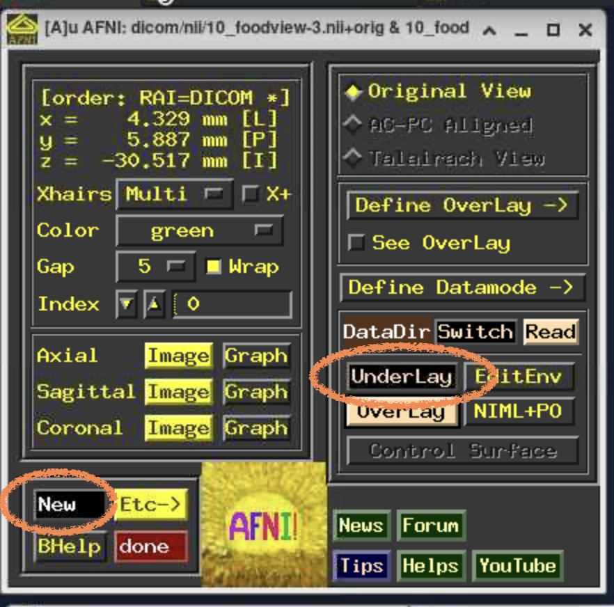
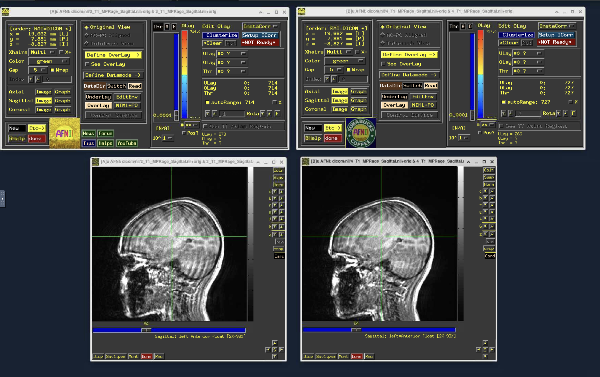
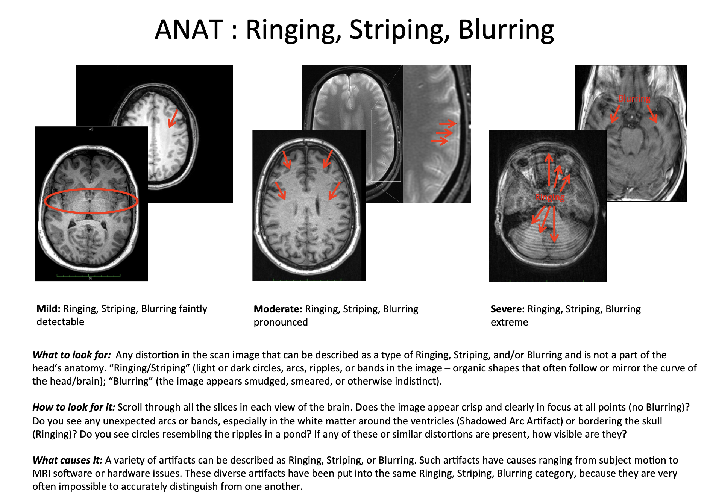
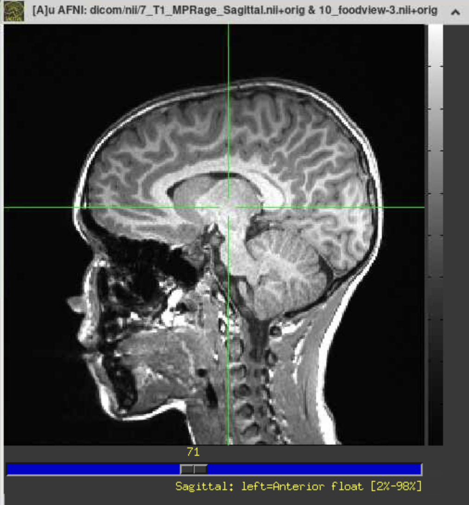
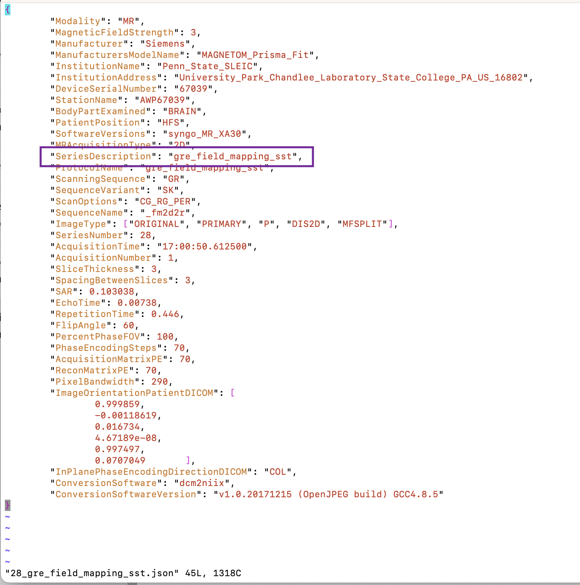

<!-- omit in toc -->
# Data Management and Processing Manual for Study REACH

- [Introduction](#introduction)
- [Data servers](#data-servers)
  - [OneDrive](#onedrive)
  - [Roar Collab](#roar-collab)
  - [Hoth](#hoth)
- [Data Organization on OneDrive and Roar Collab](#data-organization-on-onedrive-and-roar-collab)
  - [untouchedRaw](#untouchedraw)
  - [bids](#bids)
    - [bids/sourcedata](#bidssourcedata)
    - [bids/rawdata](#bidsrawdata)
    - [bids/phenotype](#bidsphenotype)
    - [bids/derivatives](#bidsderivatives)
    - [bids/code](#bidscode)
- [Data Processing Pipeline](#data-processing-pipeline)
  - [Overview](#overview)
  - [Required access](#required-access)
  - [Required software](#required-software)
  - [Processing steps](#processing-steps)
    - [1. Transfer data to servers for processing](#1-transfer-data-to-servers-for-processing)
      - [1.1. Transfer survey data from REDCap to OneDrive](#11-transfer-survey-data-from-redcap-to-onedrive)
      - [1.2. Copy task data from its source to OneDrive](#12-copy-task-data-from-its-source-to-onedrive)
      - [1.3. Copy MRI data from Hoth to Roar Collab](#13-copy-mri-data-from-hoth-to-roar-collab)
    - [2: Process Survey and Task Data](#2-process-survey-and-task-data)
    - [3. Sync processed survey and task data to Roar Collab](#3-sync-processed-survey-and-task-data-to-roar-collab)
    - [4. Organize MRI data into BIDS](#4-organize-mri-data-into-bids)
      - [4.1. Copy data into bids/sourcedata/](#41-copy-data-into-bidssourcedata)
      - [4.2. Label "extra scans" in bids/sourcedata/](#42-label-extra-scans-in-bidssourcedata)
      - [4.3. Add field map SeriesDescription to fmap\_descriptions.csv](#43-add-field-map-seriesdescription-to-fmap_descriptionscsv)
      - [4.4. Convert MRI data to BIDS in rawdata/](#44-convert-mri-data-to-bids-in-rawdata)
    - [5. Check BIDS compliance](#5-check-bids-compliance)
    - [6. Run MRIQC](#6-run-mriqc)
    - [7. Run fmriprep](#7-run-fmriprep)
- [Data Quality Control](#data-quality-control)
- [Using the data](#using-the-data)
  - [General usage notes](#general-usage-notes)
  - [Combining datasets](#combining-datasets)
- [Correcting data entry/collection errors](#correcting-data-entrycollection-errors)
  - [Errors in survey data](#errors-in-survey-data)
  - [Errors in task data](#errors-in-task-data)
  - [Errors in MRI data](#errors-in-mri-data)


# Introduction

Welcome! This manual outlines the data management and processing protocol for project REACH.

This manual is being continuously updated by Bari Fuchs as the data processing pipeline is refined. This document is generated by a markdown file found [here](https://github.com/bfuchs18/R01_Marketing/blob/master/docs/reach_data_management_manual.md#introduction).

If you have questions, reach out to Bari Fuchs at baf44@psu.edu.

# Data servers

Managing and processing REACH data requires connecting to several servers and data-storage systems. Steps to gain access to these servers are detailed in [Required Access](#required-access).

## OneDrive

OneDrive is the cloud storage service used by Penn State. Survey and task data are stored on OneDrive and processed locally (i.e., on your computer) using OneDrive Sync. With OneDrive Sync, files on OneDrive are synced to your computer, where they can be processed (e.g., with R); processed files are then synced to OneDrive.

[Setting up OneDrive Sync](https://support.microsoft.com/en-us/office/sync-files-with-onedrive-in-windows-615391c4-2bd3-4aae-a42a-858262e42a49)

## Roar Collab

Roar Collab is Penn State's Linux-based High Performance Computing Cluster. This is where MRI data are stored, processed, and analyzed. Survey and behavioral data are synced to Roar Collab after being processed locally so they can be used in MRI analyses. 

Processing data on Roar Collab involves using a command-line interface to navigate directories and run scripts. Thus, familiarity with basic [linux commands](https://www.hostinger.com/tutorials/linux-commands) is required. 

Roar Collab can be accessed via an SSH connection with submit.hpc.psu.edu and through an interactive deskop. 

<!-- omit in toc -->
### Connecting via SSH
To connect via SSH, open a terminal on macOS or Linux or the command prompt on Windows and enter the following command, replacing userid with your Penn State user ID (e.g., baf44):

```bash
# SSH into Roar Collab (replace userid with your Penn State user ID))
ssh userid@submit.hpc.psu.edu
```
This will prompt you to enter your password.

<!-- omit in toc -->
### Using interactive desktop

To start an interactive desktop, sign into the Penn State Roar Collab Portal at [https://rcportal.hpc.psu.edu/pun/sys/dashboard](https://rcportal.hpc.psu.edu/pun/sys/dashboard) and launch a new Interactive Desktop.


For more details on using Roar Collab, see the Roar Collab User Guide [here](https://www.icds.psu.edu/roar-collab-high-performance-computing-overview/).

## Hoth

Hoth is the server where SLEIC uploads MRI data, which we then copy to Roar Collab.  

Hoth can be connected to via an SSH connnection with linux.imaging.psu.edu. To do this, open a terminal on macOS or Linux or the command prompt on Windows and enter the following command, replacing userid with your Penn State user ID (e.g., baf44):

```bash
# SSH into Hoth (replace userid with your Penn State user ID)
ssh userid@linux.imaging.psu.edu
```
This will prompt you to enter your password.

# Data Organization on OneDrive and Roar Collab

Data on [OneDrive](#onedrive) are stored in the folder: 
b-childfoodlab_Shared > Active_Studies > MarketingResilienceRO1_8242020 > ParticipantData

Data on [Roar Collab](#roar-collab) are stored in the folder:
storage > group > klk37 > default > R01_Marketing

The sub-directories within ParticipantData/ (on OneDrive) and R01_Marketing/ (on Roar Collab) are the same and look like:

- (ParticipantData or R01_Marketing)
  - **untouchedRaw**
  - **bids**
    - **sourcedata**
    - **rawdata**
    - **derivatives**
    - **code**
  
Because they are the same, files in untouchedRaw/ and bids/ can easily be synced between the servers. 

Survey and task data always begin on OneDrive and are then synced to Roar Collab. MRI data exists on Roar Collab only due to the size of the files and need for more computational resources when processing. 

Via data processing, survey data flows from its source (REDCap) to bids/sourcedata/phenotype to bids/phenotype/. Task and MRI data flow from their sources (task-specific computers or Hoth, respectively) to untouchedRaw/ to bids/sourcedata/ to bids/rawdata/ (Figure 1). The contents of these folders are summarized in Table 1 and detailed in subsections below.

 \
Figure 1. Data Flow


Table 1. Directories and descriptions
| Directory    | Description |
| -------- | ------- |
| untouchedRaw  |  Contains task and MRI data in their original form. Data in this folder serves as a backup and should never be directly worked from.  |
| bids | Contains survey*, task, and neuroimaging data across differnt stages of processing, organized according to BIDS standards   |
| bids/sourcedata    | Contains copies of task and neuroimaging data from untouchedRaw and survey data downloaded from redcap. Data in this folder will be organized into bids/rawdata and bids/phenotype 
| bids/rawdata    | Contains task and neuroimaging data organized according to BIDS standards|
| bids/phenotype    | Contains survey data organized according to BIDS standards |
| bids/derivatives    | Contains processed data or generated datasets |
| bids/code    | Contains code to organize and process data within bids/ |

\* Survey refers to data collected in survey format via redcap, including questionnaires and researcher-entered data (e.g., intake measurements) 


## untouchedRaw

untouchedRaw/ contains task and MRI data transferred directly from the source (for task data, the source is where the task program exports the data; for MRI (DICOM) data, the source is Hoth, a server where SLEIC uploads the data). untouchedRaw/ is organized by task, such that data for each task is found within a task-specific folder:

  - untouchedRaw
    - foodview_task
    - hrv
    - nih-toolbox
    - pit_task
    - rrv_task
    - rsa
    - space_game
    - sst
    - tictach_task
    - DICOMS * 

*DICOMS are stored on Roar Collab only due to size

## bids

Data within bids/ are organized to comply with the [Brain Imaging Data Structure](https://bids.neuroimaging.io/). 

### bids/sourcedata

bids/sourcedata/ contains copies of data from untouchedRaw/. However, data are now organized by subject and session: each subject has a folder (sub-{label}) in /sourcedata, and within each subject folder are session folders (ses-{label}). Session folders  separate data collected at baseline (REACH visits 1 through 4) and follow-up (REACH visit 5). Within session folders, task data are stored in beh/ and MRI data are stored in dicom/. 

bids/sourcedata/ also contains survey data downloaded from REDCap, stored in /phenotype.

This looks like: 
- bids
  - sourcedata
    - sub-{label}
      - ses-1
        - dicom
          - [Imaging data collected at baseline]
        - beh
          - [Task files collected at baseline]
      - ses-2
        - beh
          - [Task files collected at follow-up]
    - phenotype
      - [redcap .tsv files]


### bids/rawdata

This folder contains "raw" task and MRI data that has been minimally processed from [bids/sourcedata/](#bidssourcedata) to comply with BIDS standards and be suitable for sharing (e.g., MRI data is de-identified). When publically sharing task and MRI data, this is the data that gets shared. Similar to bids/sourcedata/, bids/rawdata/ is organized by subject and session. However, subdirectories will differ by modality: MRI data is stored in fmap/, func/, and anat/. Task data is stored in func/ if it was collected alongside fMRI data and beh/ if it was not.

Meta-data for files in bids/rawdata are stored in corresponding JSON files. For MRI data (i.e., nii.gz files), JSONS are subject specific, so they are stored in subject folders alongside the MRI data. For task data (i.e., TSV files), JSONS are stored directly in rawdata/ and apply to all corresponding files in subject and session directories.

This looks like: 
- bids
  - rawdata/
    - [Behavioral task meta-data JSONS]
    - sub-{label}/
      - ses-1/
        - fmap/
          - [Field map MRI data - these end with *.nii.gz]
          - [Field map meta-data JSON files]
        - func/
          - [fMRI data for Food View Task and SST - these end with *.nii.gz]
          - [fMRI meta-data JSON files]
          - [Behavioral data for Food View task and fMRI SST - these end with *_events.tsv]
        - anat/
          - [Structural MRI data - these end with *.nii.gz]
          - [Structural MRI meta-data JSON file]
        - beh/
          - [Behavioral data for tasks *not* collected alongside fMRI data - these end with *_beh.tsv]
      - ses-2/
        - beh/
          - [Behavioral data for tasks *not* collected alongside fMRI data - these end with *_beh.tsv]

Remember, MRI data (i.e., nii.gz files) will only exist on Roar Collab due to size. Task data (i.e., TSV files) can be synced between OneDrive and Roar Collab. 

### bids/phenotype

This folder contains questionnaire, intake, anthropometrics, and dexa data stored in .tsv files. Data for each survey is saved in its own file. TSVs contain raw data, and can also contain derivative data (e.g., questionnaire scores, computed variables). Each data file is accompanied by a JSON meta-data file.

For example:

- bids
  - phenotype
    - {survey-name}.tsv
    - {survey-name}.json


### bids/derivatives

This folder contains datasets that have been derived from data in [bids/rawdata/](#bidsrawdata). The following derivative datasets have been created:

- bids
  - derivatives
    - mriqc
      - [Quality assessment files generated by mriqc]
    - preprocessed/fmriprep_v2401
      - [Preprocessed fmri data, output of fmriprep version 24.0.1]
    - beh
      - [TSV files with summary metrics for each behavioral task]


### bids/code

This folder contains code to organize and process data within bids/.


# Data Processing Pipeline

## Overview

The data processing pipeline includes steps to get data from its source into analysis-ready formats. 

The steps are:

1. Transfer data to servers for processing
   1. Download survey data from REDCap to OneDrive
   2. Copy task data from administration computer to OneDrive
   3. Copy MRI data from Hoth to Roar Collab
2. Process survey and task data locally with OneDrive sync
   1. Get data into BIDS
   2. Generate derivative databases with summary metrics
3. Sync survey and task data to Roar Collab
4. Organize MRI data into BIDS
   1. Copy data into sourcedata/
   2. Label "extra scans"
   3. Add field map desciription to fmap_descriptions.csv
   4. Convert MRI data to BIDS in rawdata/
5. Check BIDS compliance
6. Generate QC metrics with MRIQC
7. Pre-process data with fMRIprep


 \
Figure 2. Data processing steps

These steps will be described in detail below. 


## Required access
Implementing the described pipeline will require access to projects/folders in:
- REDCap (online data collection software)
- OneDrive (Microsoft's cloud storage service used by Penn State)
- Hoth (server where SLEIC uploads imaging data)
- Roar Collab (Penn State's High Performance Computing Cluster)

Steps to aquire access are outlined in Table 2.

Table 2. Access required for data processing
<div style="font-size: 12px;">

| Server | Project/Folder | Getting Server Access | Getting project/folder access | Required To... |
| -------- | ------- | ------- | ------- | ------- |
| REDCap | 'Food Marketing Resilience/Project REACH' and 'REACH Data Double Entry' projects | Go to https://ctsi.psu.edu/research-support/redcap/ and select "REQUEST REDCAP ACCESS (NEW USERS"; Requires REDCap training | ask Kathleen Keller (klk37@psu.edu) to grant access | download Survey data from REDCap |
| OneDrive |  b-childfoodlab_Shared/ | Students and staff with @psu.edu emails automatically get access | ask Kathleen Keller (klk37@psu.edu) to grant access | transfer and access task (beh) and survey data on OneDrive |
| Hoth |  /nfs/imaging-data/3Tusers/klk37/mrkt/ | email	l-sleic-helpdesk@lists.psu.edu and request access, cc Kathleen Keller (klk37@psu.edu)  | email	l-sleic-helpdesk@lists.psu.edu and request access, cc Kathleen Keller (klk37@psu.edu) | retrieve MRI data after SLEIC uploads it to Hoth |
| Roar Collab |  storage/group/klk37/ | follow instructions at https://www.icds.psu.edu/account-setup/  | email iask@ics.psu.edu and request access, cc Kathleen Keller (klk37@psu.edu) | copy MRI data to Roar Collab; access and process MRI data on Roar Collab; sync task and survey data from OneDrive to Roar Collab|

<div style="font-size: 16px;">


## Required software 

Implementing the processing pipeline requires the following software to be available either locally (for processing survey and task data that are available on your computer with OneDrive Sync) or on Roar Collab (for processing MRI data).

<!-- omit in toc -->
### R01_Marketing
* [https://github.com/bfuchs18/R01_Marketing](https://github.com/bfuchs18/R01_Marketing)
* This github repository contains R, Python, and shell scripts to organize, processess, and analyze REACH data. These are located in ParticipantData/bids/code.
* The scripts in this repositiory call the software outlined below. 
* Scripts in this repo are need locally and on Roar Collab.
* I recommend downloading the entire repository onto your computer

<!-- omit in toc -->
### R
* [https://www.r-project.org/](https://www.r-project.org/)
* This software is needed locally
* R is a software environment for statistical computing and graphics and is required to process task and survey data using [dataREACHr](#datareachr) and [dataprepr](#dataprepr)


<!-- omit in toc -->
### dataREACHr
* [https://github.com/bfuchs18/dataREACHr](https://github.com/bfuchs18/dataREACHr)
* This software is needed locally
* This is an R package that contains functions to process and organize survey and task data into bids/phenotype and bids/rawdata, respectively.
* dataREACHr can be installed from github in R using the devtools package:
```r
devtools::install_github("bfuchs18/datareachr")
```
<!-- omit in toc -->
### dataprepr

* [https://github.com/alainapearce/dataprepr](https://github.com/alainapearce/dataprepr)
*  This software is needed locally
* This is an R package that contains functions to score a variety of validated questionnaires
* This is a dependecy of [dataREACHr](#datareachr) -- loading dataREACHr will prompt installation of dataprepr if it is not installed. 
* Dataprepr can also be installed from github in R using the devtools package:

```r
devtools::install_github("alainapearce/dataprepr")
```

<!-- omit in toc -->
### dcm2bids
*  [https://unfmontreal.github.io/Dcm2Bids/3.1.1/](https://unfmontreal.github.io/Dcm2Bids/3.1.1/)
*  This software is needed on Roar Collab
*  This is a program that reorganises NIfTI files into the Brain Imaging Data Structure (BIDS).
*  Data processing scripts expect dcm2bids to be loaded via a conda environment described in [/bids/code/dcm2bids/dcm2bids.yml](https://github.com/bfuchs18/R01_Marketing/blob/master/ParticipantData/bids/code/dcm2bids/dcm2bids.yml). 
*  

dcm2bids.yml is present on Roar Collab, so the conda env can be created by running the following commands in a Bash terminal on Roar Collab

```bash
# if conda has not been initialized, may need to run this first and then close and reopen terminal
conda init bash 

# Navigate to yml file
cd /storage/group/klk37/default/R01_Marketing/bids/code/dcm2bids/

# Load anaconda
module load anaconda

# Create a conda environment based on yml file
## Note, this will create the conda env in a user-specific directory, so every user has to create their own environemnt
conda env create -f dcm2bids.yml

# activate enviroment
conda activate dcm2bids
```

<!-- omit in toc -->
### pydeface
*  [https://github.com/poldracklab/pydeface](https://github.com/poldracklab/pydeface)
*  This software is needed on Roar Collab
*  This is a tool to remove facial structure from (i.e., "deface") MRI images. 
*  Data processing scripts expect pydeface to be loaded via a conda environment described in /bids/code/dcm2bids/dcm2bids.yml. See the [dcm2bids](#dcm2bids) section for details on how to create the conda environment.

<!-- omit in toc -->
### mriqc
* [https://mriqc.readthedocs.io/en/stable/index.html](https://mriqc.readthedocs.io/en/stable/index.html)
* MRIQC extracts no-reference IQMs (image quality metrics) from structural (T1w and T2w) and functional MRI (magnetic resonance imaging) data. 

A container with MRIQC version 24.0.0 was built by running the following command in a Bash terminal on Roar Collab
```bash
singularity build /storage/group/klk37/default/sw/mriqc-24.0.0.simg  docker://nipreps/mriqc:24.0.0
```

<!-- omit in toc -->
### fmriprep
* [https://fmriprep.org/en/stable/outputs.html](https://fmriprep.org/en/stable/outputs.html)
* This software is needed on Roar Collab
* fMRIprep is a preprocessing software for MRI data
* On Roar Collab, fMRIprep version 24.0.1 is available in a Singularity Container within /storage/group/klk37/default/sw/fmriprep-23.2.0.simg. By using this singularity container, we can use a version of fMRIprep that is not presently available to all users of Roar Collab.

The container was created by running the following command in a Bash terminal on Roar Collab
```bash
singularity build /storage/group/klk37/default/sw/fmriprep-24.0.1.simg docker://nipreps/fmriprep:24.0.1
```

* Version 24.0.1 was selected for processing because it is (or was) the most recent version available. To use other versions, build another singularity container by specifying a different version number in the command above

<!-- omit in toc -->
### afni
* [https://afni.nimh.nih.gov/](https://afni.nimh.nih.gov/)
* This software is needed on Roar Collab
* On Roar Collab, AFNI version 24.2.01 is available in a Singularity Container within /storage/group/klk37/default/sw/afni-24.2.01.simg. By using this singularity container, we can use a version of AFNI that is not presently available to all users of Roar Collab.

The container was created by running the following command in a Bash terminal on Roar Collab
```bash
# If 24.2.01 is the latest version available (check tags to see AFNIs latest push: https://hub.docker.com/r/afni/afni_make_build/tags), can use this command:
singularity pull afni-24.2.01.simg docker://afni/afni_make_build

# pull version 24.2.01
singularity pull afni-24.2.01.simg docker://afni/afni_make_build:AFNI_24.2.01

```

## Processing steps
### 1. Transfer data to servers for processing

Before we can begin processing any data, we need to copy data from their source to the server in which they will be processed. For survey and task data, this is OneDrive. For MRI data, this is Roar Collab. 


#### 1.1. Transfer survey data from REDCap to OneDrive

   1. Log in to redcap at [https://redcap.ctsi.psu.edu/](https://redcap.ctsi.psu.edu/)
   2. Download visit data
      1. Navigate to the REDCap project: Food Marketing Resilience/Project REACH
      2. Select 'Data Exports, Reports, and Stats'
      3. Select 'Export data' for the Report Name '**All data** (all records and fields)'
      4. Choose export format: 'CSV/Microsoft Excel (raw data)'
      5. Select export then click icon to download
      6. Transfer file to OneDrive Folder: b-childfoodlab_Shared/Active_Studies/MarketingResilienceRO1_8242020/ParticipantData/bids/sourcedata/phenotype
   3. Download double-entry data
      1. Navigate to the REDCap project: REACH Data Double Entry
      2. Select 'Data Exports, Reports, and Stats'
      3. Select 'Export data' for the Report Name '**All data** (all records and fields)'
      4. Choose export format: 'CSV/Microsoft Excel (raw data)'
      5. Select export then click icon to download
      6. Transfer file to OneDrive Folder: b-childfoodlab_Shared/Active_Studies/MarketingResilienceRO1_8242020/ParticipantData/bids/sourcedata/phenotype


#### 1.2. Copy task data from its source to OneDrive

   1. Locate task data at the source
      1. This location is task-specfic; it is typically on the computer used to administer the task (Table 3)
   2. Copy data onto OneDrive into the task-specific folder in [untouchedRaw/](#untouchedraw) (i.e., b-childfoodlab_Shared/Active_Studies/MarketingResilienceRO1_8242020/ParticipantData/untouchedRaw/)
      1. This should happen as soon as possible after data is collected. 
         1. Unlike OneDrive, the computers used for task data collection are not permanent storage locations and are not backed up. 
         2. Do not delete the data from the source. It can remain in that location as a backup until computer resources require files to be removed.
   3. If needed, rename the file in untouchedRaw to adhere to the expected file naming convention (Table X),
  
Table 3. Copying Task Data to untouchedRaw/ on OneDrive
<div style="font-size: 12px;">

| Task    | Data to tranfer | Where data is initially exported | Folder in untouchedRaw | untouchedRaw Naming Convenction |
| ------ | ------ | ------ | ------ | ----- |
| Reinforcing Value of Food Task | `game.csv` <br> `summary.csv` <br> `REACH_{ID}.txt`| On the laptop used for administation in XXX | rrv_task/REACH_{ID} | `rrv_{ID}_game.csv` <br> `rrv_{ID}_summary.csv` <br> `rrv_{ID}.txt` 
| Stop Signal Task | `stop_onsets-{ID}.txt` <br> `stop-{ID}.txt` | On the laptop used for administation in XX| sst | `stop_onsets-{ID}.txt` <br> `stop-{ID}.txt`
| Food View Task | `foodview_onsets-{ID}.txt` <br> `foodview-{ID}.txt` | On the laptop used for administation in XX | foodview_task | `foodview_onsets-{ID}.txt` <br> `foodview-{ID}.txt`
| NIH Toolbox | `{Date} Assessment Data.csv` <br> `{Date} Assessment Scores.csv`  <br> `{Date} Registration Data.csv` | | nih-toolbox |
| Space Game | | |  space_game |
| Pavlovian-to-Intrumental Transfer Task | | On the laptop used for administration in: C:\Project REACH\PIT_Task\Food_PIT| pit_task |

<div style="font-size: 16px;">

#### 1.3. Copy MRI data from Hoth to Roar Collab

MRI data needs to be securely copied (scp) from [Hoth](#hoth) to [Roar Collab](#roar-collab). This is done via SSH connections.

<!-- omit in toc -->
##### 1.3.1 Rename directory in Hoth for transfer

Before transferring the data, we want to update the folder name on Hoth so it follows the naming convention mrkt_XXX (where XXX is a 3-digit ID). To do this, [connect to Hoth with SSH](#hoth). While connected to Hoth, enter the following commands (example for subject 001):

```bash
# navigate to where SLEIC uploads data
cd /nfs/imaging-data/3Tusers/klk37/mrkt

# list contents of mrkt directory
ls

# rename subject's data directory to follow formatting mrkt_XXX (example for sub 001)
mv mrkt_1 mrkt_001 ## for a different subject, replace mrkt_1 with the present folder name and mrkt_001 with the desired folder name
```
<!-- omit in toc -->
##### 1.3.2 Run SCP command from Roar Collab

Once the folder name is updated in Hoth, it is ready to be transfered to Roar Collab with scp. To do this, [connect to Roar Collab with SSH](#roar-collab). While connected to Roar Collab, enter the following commands (example for subject 001):

```bash
# navigate to where data will be copied to
cd /storage/group/klk37/default/R01_Marketing/untouchedRaw/DICOMS

# copy data from Hoth into current directory (on Roar Collab -- signaled with '.')
### replace userid with your user ID (e.g., baf44) and mrkt_001 with folder to copy
### running this command will prompt you for a password 
scp -r userid@linux.imaging.psu.edu:/nfs/imaging-data/3Tusers/klk37/mrkt/mrkt_001 ./

# list contents of directory to confirm all files were transferred
ls
```

### 2: Process Survey and Task Data

Once survey and task data exist on OneDrive (steps [1.1-1.2](#1-transfer-data-to-servers-for-processing)), we can organizing them into BIDS (step 2.1) and generating derivative databases (step 2.2). The recommendation is to do both steps locally (i.e., with OneDrive files synced to computer) and then sync processed files to Roar Collab for use with MRI analyses. 

Organization of survey and task data into BIDS (step 2.1) and generation of derivative databases (step 2.2) can be done using the script [beh_into_bids.R](https://github.com/bfuchs18/R01_Marketing/blob/master/ParticipantData/bids/code/beh_into_bids.R) which is shared in the [R01_Marketing GitHub Repository](##r01_marketing). beh_into_bids.R sources a [configuration file](https://github.com/bfuchs18/R01_Marketing/blob/master/ParticipantData/bids/code/config_redcap_sourcedata.R) that specifies the names of REDCap files to be processed. 

Prerequisits to using beh_into_bids.R:
- [R](#r), [dataREACHr](#datareachr), and dataREACHr dependencies, including [dataprepr](#dataprepr), must be installed on your computer
-  OneDrive files must be synced to your computer 
-  beh_into_bids.R and config_redcap_sourcedata.R must exist in ParticipantData/bids/code/

Using beh_into_bids.R:
1. Specify the REDCap file names to process in config_redcap_sourcedata.R
2. Specify the path to ParticipantData/ on the local machine (synced with OneDrive) with the variable 'base_dir'
3. Source beh_into_bids.R to run the entire file 
4. Examine the output of beh_into_bids.R in the console. This contains information about processing progress, data quality, and the command to sync data to Roar Collab

Overview of beh_into_bids.R:

- Survey data is processed using dataREACHr::proc_redcap(). This function:
  * Imports visit and double-entry data downloaded from redcap
  * Calls dataREACHr and dataprepr functions to extract, process, and score data
  * Exports participants.tsv data files and participants.json meta-data files into [bids/](#bids).
  * Exports {survey}.tsv data files and {survey}.json meta-data files into [bids/phenotype/](#bidsphenotype).
- Quality checks are run on processed survey data (returned by dataREACHr::proc_redcap())
- Task data is processed using dataREACHr::proc_task(). This function:
  * Copies task data from [bids/untouchedRaw](#untouchedraw) into [bids/sourcedata/](#bidssourcedata)
    * This is done with util_org_sourcedata(), which presently copies data for: FoodView, SST
  * Processes and exports task data into [bids/rawdata/](#bidsrawdata) for:
    * food view task (using util_task_foodview())
    * SST (using util_task_sst())
  * Exports a meta-data JSON file into bids/rawdata for the following tasks: foodview_bold, sst_bold, sst_beh
    * Done using write_task_jsons()
- Derivative task databases are created and exported with dataREACHr::proc_task_derivs. This function:
  - Calls functions that create derivative databases for the following tasks: RRV, SST, FoodView
  - Calls functions that create JSON files for the following tasks: RRV, SST, FoodView
  - Exports databases as .TSV files and meta-data as .JSON files into /bids/derivatives/beh_summary_databases/
- Prompts the user to enter a specific rsync command to sync data from untouchedRaw/ and bids/ on OneDrive to Roar Collab
  - I (Bari) have had issues running the rsync command through R with system(rsync_cmd), so this command is commented out in beh_into_bids.R and the rsync command is printed into the console for the manager to manually copy-and-paste into a terminal. 

### 3. Sync processed survey and task data to Roar Collab

To keep Roar Collab up-to-date with OneDrive, it is recommended to sync processed survey and task data each time beh_into_bids.R is run. The command to sync data is printed into the console by beh_into_bids.R. This command takes into account 

### 4. Organize MRI data into BIDS

Once MRI data is on Roar Collab ([step 1.3](#13-copy-mri-data-from-hoth-to-roar-collab)), we can organize it into BIDS. To do this, [connect to Roar Collab with SSH](#roar-collab) and:

#### 4.1. Copy data into bids/sourcedata/

```bash
# naviagate to directory with 1_pre-dcm2bids.tsch script
cd /storage/group/klk37/default/R01_Marketing/bids/code/dcm2bids

# run shell script to copy data from untouchedRaw/ into bids/sourcedata/for sub 001 (replace 001 with ID to process)
./1_pre-dcm2bids.tsch 001
```

#### 4.2. Label "extra scans" in bids/sourcedata/

"Extra" scans refer to T1 or T2* scans that should NOT be organized into BIDS and preprocessed. An extra T1 will exist if multiple T1 scans were collected (e.g., if the first one had excessive motion so another was collected). Extra functional scans can exist if a run was aborted early and restarted. To prevent these repeated scans from being organized into BIDS, we will append the directories with "_extra".

<!-- omit in toc --> 
##### 4.2.1 Determining if there are extra scans
To determine if a subject has extra scans, examine the contents of their dicom/nii directory. In this folder, you will see a .nii file for each scan collected, as well as a corresponding json file. If there are > 1 nii files that contain 'T1_MPRage_Sagittal' (e.g., 3_T1_MPRage_Sagittal.nii, 4_T1_MPRage_Sagittal.nii), this indicates multiple T1 scans were collected. IF there are > 1 nii files for the same functional run (e.g., 5_foodview-1.nii, 6_foodview-1.nii) this indicates this run was repeated. 

```bash
# navigate to subject sourcedata dicoms (replace $ID with 3-digit subject ID)
cd /storage/group/klk37/default/R01_Marketing/bids/sourcedata/sub-$ID/ses-1/dicom/nii

# list contents
ls 
```

<!-- omit in toc --> 
##### 4.2.2 Determining which anatomical scan is "extra"
The "extra" anatomical scan will be the one of lesser quality. This is determined by visual inspection of the anatomical scans. Scans can be visualized using the interactive desktop in the Penn State Roar Collab Portal accessed at [https://rcportal.hpc.psu.edu/pun/sys/dashboard](https://rcportal.hpc.psu.edu/pun/sys/dashboard)

1. Sign into the portal and launch a new Interactive Desktop.
2. From the interactive desktop, open a terminal from "Applications"
3. Use terminal to open up anatomical scans in AFNI:

```bash
# Navigate to location of extra scans (replace $ID with 3-digit subject ID)
cd /storage/group/klk37/default/R01_Marketing/bids/sourcedata/sub-$ID/ses-1/dicom/nii

# load afni
module load afni

# open AFNI gui
afni
```
Opening AFNI will launch a set of windows labeled [A]. To visualize multiple scans at a time for easy comparison, click "New" in the AFNI GUI (Figure 3). This will launch a second set of window labeled [B].

To view the anatomical scans, select "Underlay" from the settings menu and then choose the MPRage (Figure 1). Select one anatomical scan in menu [A] and the other in menu [B]. View the brain in the axial/sagitall/coronal orientations by selecting "Image" next to each option. The coordinates for [A] and [B] are locked so that when you click around in one image, it will change the location in the other. 

 \
Figure 3. AFNI GUI settings menu with "New" and "Underlay" circled

Once scans are loaded into the GUI, visually compare the images to determine which is better quality (Figure 4). Better quality scans will show less movement artifacts, such as blurring, ringing, and striping (Figure 5). High quality scans will not show these artifacts (Figure 6.)

 \
Figure 4. AFNI GUI with 2 MPRages loaded in separate windows. Both show a lot of ringing and are low-quality scans. However, the scan in [B] (right panel) shows slighly less extreme ringing (e.g., in cerebellum). Therefore, the scan loaded in [A] should be labeled as 'extra'.

 \
Figure 5. Anatomical scan artifacts

 \
Figure 6. Example of high-quality MPrage. Beautiful!

<!-- omit in toc --> 
##### 4.2.3 Determining which functional scan is "extra"
Typically, an "extra" functional scan will occur when a run was aborted early on and re-run. Therefore, the "extra" scan will be the first scan collected, and it should have less TRs collected. To confirm this, we will assess the number of volumes collected for each of the runs by counting the number of .dcm files in the corresponding ser directory. The corresponding ser directory includes the number that the file in /dicom/nii starts with. For example, the file /dicom/nii/5_foodview-1.nii corresponds to /dicom/ser5.

```bash
# navigate into ser directory that corresponds to the functional run at hand (example with ser5)
cd /storage/group/klk37/default/R01_Marketing/bids/sourcedata/sub-$ID/ses-1/dicom/ser5

# count the number of files (1 file = 1 volume/TR)
ls | wc -l #pipes output of ls into wc -l
```

A complete foodview run = 131 dicoms \
A complete sst run = 148 dicoms 

If only a few dcms are in the ser directory (i.e., only a few volumes were collected), this is the "extra" functional scan. 

<!-- omit in toc --> 
##### 4.2.4 Labeling extra scans
Extra scans are labeled by renaming the corresponding dicom/ser directory with "_extra". The ser directory will include the number that the file in /dicom/nii starts with. For example, the file /dicom/nii/3_T1_MPRage_Sagittal.nii corresponds to /dicom/ser3 while /dicom/nii/4_T1_MPRage_Sagittal.nii corresponds to /dicom/ser4.

```bash
# navigate to subject sourcedata dicoms
cd /storage/group/klk37/default/R01_Marketing/bids/sourcedata/sub-$ID/ses-1/dicom/

# rename the ser directory that corresponds to the extra scan with mv
# Example: rename ser6 to ser6_extra
mv ser6 ser6_extra

```


#### 4.3. Add field map SeriesDescription to fmap_descriptions.csv

fmap_descriptions.csv is a comma separated file that contains foodview and SST fieldmap SeriesDescription's for each subject (Figure 7). ‘SeriesDescription' is the description of a fieldmap according to its json file. For every fieldmap collected, there will be 3 images (magnitude1, magnitude2, phasediff) that use the same 'SeriesDescription'. For most subjects, there will be separate fieldmaps for the SST and FV tasks. Fieldmap SeriesDescription's will differ across subjects due to how fieldmaps were named during scanning (eventually, names were standardized in the MRI protocol, but we want to check for each subject anyway).

2_dcm2bids.tcsh will reference fmap_descriptions.csv when generating config files to assign the correct fieldmap 'SeriesDescription' for each subject. dcm2bids is case sensitive, so the SeriesDescriptions gre_field_mapping_sst and gre_field_mapping_SST are *not* the same. 

<!-- omit in toc --> 
#### 4.3.1 Assess jsons to determine the SeriesDescription (Figure 5)
```bash
# Navigate to /nii (where .nii and jsons are stored)
cd /storage/group/klk37/default/R01_Marketing/bids/sourcedata/sub-$ID/ses-1/dicom/nii

# open jsons with vim (replace variables with names of json files) -- inspect to identify SeriesDescription
vi $sst_json_filename #e.g., 28_gre_field_mapping_sst.json
vi $foodview_json_filename #e.g., 14_gre_field_mapping_fv.json

# To close vim, type :q enter
```
 \
Figure 7. Example SST fieldmap json opened with vim. This fieldmap has the SeriesDescription "gre_field_mapping_sst"

<!-- omit in toc --> 
#### 4.3.2 Add SeriesDescription to fmap_descriptions.csv (Figure 6)
```bash 
# Navigate to code/dcm2bids directory
cd /storage/group/klk37/default/R01_Marketing/bids/code/dcm2bids

# open fmap_descriptions.csv using vim
vi fmap_descriptions.csv

# in vim:     
## enter 'insert mode' by typing :i
## add new row with subject ID and SeriesDescritions for food view and sst (in that order and comma-separeted)
## when done making changes, press esc to exit 'insert mode'
## write (save) changes and quit vim by typing :wq
```

#### 4.4. Convert MRI data to BIDS in rawdata/

MRI data in sourcedata is converted to BIDS format using the script 2_dcm2bids.tcsh. This script can be used in two ways: (A) called directly to process data for 1 subject at a time, (B) called indirectly via batch_dcm2bids.slurm to process data for all subjects with data in bids/sourcedata.

2_dcm2bids.tcsh will:

  1) Use [template_dcm2bids_config.json](#create-dcm2bids-configuration-file-template) and [fmap_descriptions.csv](#5-add-fieldmap-seriesdescriptions-to-fmap_descriptionscsv) to generate a subject-specific [configuration file](#https://unfmontreal.github.io/Dcm2Bids/3.1.1/how-to/create-config-file/) that specifies how to configure the BIDS directories
  2) Create a temporary sourcedata directory [without the “_extra” ser/ directories](#3-label-extra-scans-in-bidssourcedata)
  3) Run dcm2bids_helper on the temporary sourcedata directory to convert the DICOMs files to NIfTI files
  4) Run dcm2bids to convert data into BIDS
  5) De-face T1 images using [pydeface](#pydeface) (requires fsl)
  6) Clean up folders by deleting temporary directories
  7) Add “IntendedFor” and “TaskName” fields to the fmap jsons

<!-- omit in toc --> 
##### Option A: run 2_dcm2bids.tcsh for 1 subject at a time
```bash
# Navigate to code/dcm2bids directory
cd /storage/group/klk37/default/R01_Marketing/bids/code/dcm2bids

# Activate dcm2bids environment (if not activated)
module load anaconda
source activate dcm2bids

# Load fsl (if not loaded)
module load fsl 

# Run dcm2bids script (replace $ID with 3 digit subject ID)
./2_dcm2bids.tcsh $ID

```
<!-- omit in toc --> 
##### Option B: process a batch of subjects via SLURM (submit job)

You do not have to specify the subjects to run via the batch script-- 2_dcm2bids.tcsh will be run for all subjects with data in bids/sourcedata. If dcm2bids has already been run for a subject, 2_dcm2bids.tcsh will skip processing them 
```bash

# Navigate to code/dcm2bids directory
cd /storage/group/klk37/default/R01_Marketing/bids/code/dcm2bids

# Submit job
sbatch batch_dcm2bids.slurm

# Check job progress (replace userid with your user ID (e.g., baf44))
squeue -u userid

# Open file with vim to review output (replace $jobid with job ID)
vi batch_dcm2bids.slurm.$jobid

```

Notes:
- If dcm2bids needs to be re-run for a subject (e.g., you forget to label extra scans first), the prior output of dcm2bids will need to be manually deleted. This can be done with the following steps:
```bash
# navigate to subject's raw data directory (replace $ID with 2 digit ID)
cd /storage/group/klk37/default/R01_Marketing/bids/raw_data/sub-$ID

# delete bids directories (rm) and their contents (-r)
rm -r func
rm -r fmap
rm -r anat
```  

### 5. Check BIDS compliance

Before creating MRI derivatives, it is valuable to check BIDS compliance. Data that is not BIDS-compliant can result in errors running MRIQC and fMRIprep. 

BIDS compliance can be checked using the online BIDS validator:

  1) Log in to the Penn State Roar Collab Portal at [https://rcportal.hpc.psu.edu/pun/sys/dashboard](https://rcportal.hpc.psu.edu/pun/sys/dashboard)
  2) Launch a Roar Collab Interactive Desktop
  3) From the interative desktop, open https://bids-standard.github.io/bids-validator/ in a web browser 
  4) Upload bids/rawdata into the Validator
  5) Review errors and warnings
  6) Resolve all errors, determine if any warnings need to be resolved


### 6. Run MRIQC

MRIQC will be used for the first round of visual data quality inspection. The script code/mriqc/mriqc_participant.slurm is used to run participant-level MRIQC via SLURM, which will generate html files for inspection. This script can be used in two ways:

<!-- omit in toc --> 
#### Participant level Option A: run mriqc_participant.slurm for specified subjects
```bash
# Navigate to code/dcm2bids directory
cd /storage/group/klk37/default/R01_Marketing/bids/code/mriqc

# submit script with 1 or more IDs specified in command line (e.g., 001, 002, 003)
sbatch mriqc_participant.slurm 001 002 003

```

<!-- omit in toc --> 
#### Participant level Option B: run mriqc_participant.slurm for all participants in bids/rawdata/
```bash
# Navigate to code/dcm2bids directory
cd /storage/group/klk37/default/R01_Marketing/bids/code/mriqc

# submit script without command line arguments
sbatch mriqc_participant.slurm
```
<!-- omit in toc --> 
#### Group-level: run mriqc_group.slurm

After MRIQC is run at the participant level, the script code/mriqc/mriqc_group.slurm is used to aggregate quality information across subjects. To run this script:
```bash
# Navigate to code/dcm2bids directory
cd /storage/group/klk37/default/R01_Marketing/bids/code/mriqc

# submit script without command line arguments
sbatch mriqc_group.slurm
```

<!-- omit in toc --> 
#### sync files to OneDrive to prepare for QC
Examining the html on Roar Collab is slow / causes the browser to crash. To sync the html file and necessary files to OneDrive, do the following locally (requires having OneDrive synced locally):

```bash
# navigate to derivatives/mriqc folder in OneDrive (update with your own path)
cd /Users/baf44/OneDrive - The Pennsylvania State University/b-childfoodlab_Shared/Active_Studies/MarketingResilienceRO1_8242020/ParticipantData/bids/derivatives/mriqc

# rsync all MRIQC output
rsync -update -av baf44@submit.hpc.psu.edu:/storage/group/klk37/default/R01_Marketing/bids/derivatives/mriqc/*  .
```

### 7. Run fmriprep

fMRIprep version 24.0.1 will be used to preprocess MRI data. The html output files of fmriprep will also be used for the second round of visual quality inspection. 

Running fMRIPrep requires that processed, behavioral task data (*_events.tsv files) have been synced to RoarCollab ([step 2](#2-process-survey-and-task-data), [step 3](#3-sync-processed-survey-and-task-data-to-roar-collab)) and that MRI data is organized into BIDS ([step 4](#4-organize-mri-data-into-bids)).

The script code/fmriprep/fmriprep_v2401.slurm is used to run fmriprep via SLURM. This script can be used in two ways:

<!-- omit in toc --> 
#### Option A: run fmriprep_v2401.slurm for specified subjects
```bash
# Navigate to code/dcm2bids directory
cd /storage/group/klk37/default/R01_Marketing/bids/code/fmriprep

# submit script with 1 or more IDs specified in command line (e.g., 001, 002, 003)
sbatch fmriprep-v2401.slurm 001 002 003

```

<!-- omit in toc --> 
#### Option B: run fmriprep_v2401.slurm for all participants in bids/rawdata/
```bash
# Navigate to code/dcm2bids directory
cd /storage/group/klk37/default/R01_Marketing/bids/code/mriqc

# submit script without command line arguments
sbatch fmriprep_v2401.slurm
```

Notes:
- fMRIprep is complete when an html QC file for a subject is generated. This will be located in bids/derivatives/preprocessed/fmriprep_v2401/sub-$ID.html 
- It is anticipated that fmriprep with freesurfer will take ~5.5 hrs to run. If fmriprep stalls or errored and needs to be re-run but freesurfer completed (output in bids/derivatives/preprocessed/fmriprep_v2401/sourcedata/freesurfer), freesurfer does not need to run again. 
- To rerun fmriprep, delete the subject's html and folder in bids/derivatives/preprocessed/fmriprep_v2401/ and rerun fmriprep.
- To rerun fmriprep and freesurfer, also delete subject's folder in bids/derivatives/preprocessed/fmriprep_v2401/sourcedata/freesurfer/
- If you would like to try processing a subject with different fmriprep settings (e.g., fieldmap-less SDC if fieldmaps are of poor quality), make a copy of fmriprep_v2401.slurm for a given sub (e.g., cp fmriprep_v2401.slurm fmriprep_v2401_sub-$ID.slurm), modify the copied file, and run the copied file for the given sub with Option A. 

<!-- omit in toc --> 
#### prepare for QC
Examining the html on Roar Collab is slow / causes the browser to crash. To sync the html file and necessary files to OneDrive, do the following locally (requires having OneDrive synced locally):
```bash
# navigate to preprocessed/fmriprep_v2401 folder in OneDrive (update with your own path)
cd /Users/baf44/OneDrive - The Pennsylvania State University/b-childfoodlab_Shared/Active_Studies/MarketingResilienceRO1_8242020/ParticipantData/bids/derivatives/preprocessed/fmriprep_v2401

# rsync figures loaded by html file (update with your user ID)
rsync --relative -av baf44@submit.hpc.psu.edu:/storage/group/klk37/default/R01_Marketing/bids/derivatives/preprocessed/fmriprep_v2401/./*/figures  .

# rsync html files (update with your user ID)
rsync --relative -av baf44@submit.hpc.psu.edu:/storage/group/klk37/default/R01_Marketing/bids/derivatives/preprocessed/fmriprep_v2401/./*html  .
```

# Data Quality Control

The data pipeline contains several steps to increase the quality of data.

1. DEXA and intake (pre and post weights) are double-entered by 2 separate researchers into REDCap. Any descrepancies in entered values are resolved by a reviewer. When the double-entry data is processed by dataREACHr::proc_redcap() in [beh_to_bids.R]( #2-process-survey-and-task-data), only data without discrepancies are included in the resulting .tsv files; discrepancies are returned in a list by proc_redcap() to prompt the manager to fix them. 

2. Automated checking of survey data with the function dataREACHr::qc_redcap() in [beh_to_bids.R](#2-process-survey-and-task-data). This checks for
   1. Duplicate data (e.g., multiple rows for a given subject/session combination) in processed phenotype databases
   2. Child visit 1 ages out of expected range (7-9)
      1. This would suggest a mis-entry of child birthdate by the parent or visit 1 protocol date by researcher
         1. If a parent mis-entered their child's birthdate in the V1 demographics form (e.g., entered the year of the study visit rather than child birth), the child birthdate in the V1 demographics form was updated by a researcher with the child birthdate provided by the parent during screening
   3. Negative consumption amounts. This would suggest that pre- or post-weights were entered incorrectly.

3. Visual inspect of MRI data for artifacts using a two-step protocol based on [Provins et al. 2023](https://www.frontiersin.org/journals/neuroimaging/articles/10.3389/fnimg.2022.1073734/full). This protocol involves:
   1. Inspecting MRIQC output for artifacts in unprocessed MRI data 
   2. Inspecting fMRIprep output for errors or issues with pre-processed MRI data


# Using the data

## General usage notes


1. Never manually edit datasets in bids/rawdata, bids/phenotype, and bids/derivatives. 
   - This is because: (1) data are organized and processed using scripts found in bids/code. When datasets are re-processed or updated using these scripts, manual edits will be overwritten; and (2) these data are shared. Someone else using the datasets may be unaware of changes you made. If you notice errors, follow the steps outlined in [Correcting data entry/collection errors](#correcting-data-entrycollection-errors).
2. Reference .json files to understand the datasets.
   - JSON files (i.e., files with .json extension) contain metadata for corresponding .tsv files. Meta-data includes information such as variable descriptions and citations.
   - Within bids/phenotypes/, each TSV file is accompanied by a corresponding JSON file with the same basename 
   - Within bids/rawdata/, meta-data for task TSV files in subject/session sub-folders are stored directly in bids/rawdata.
     - E.g., metadata for /bids/rawdata/sub-001/ses-1/beh/sub-001_ses-1_task-sst_beh.tsv can be found within /bids/rawdata/task-sst_beh.json 
3. Specify 'n/a' as the value for missing data in statistical software
  - In compliance with BIDS, 'n/a' is used to indicate missing data in rawdata and derivatives datasetes. To prevent software from interpreting 'n/a' as a string rather than missing data, it can be helpful to specify 'n/a' as the value to set as missing.

In R missing values can be specified at import:
```
# specify file path (update path to file)
path_to_file <- paste0('path/to/file.tsv')

# import data from TSV, specifying missing data values as "n/a"
data <- read.delim(path_to_file, na.strings = "n/a")
```

In SPSS missing values can be specified using the MISSING VALUES command. 


## Combining datasets
All datasets in bids/phenotype/ contain participant_id and session_id columns that indicate the subject identifier (e.g., sub-001) and when data were collected (i.e., ses-1/baseline or ses-2/follow-up), respectively. Data collected across multiple visits are stored in long format, meaning that within a dataset, a subject has a separate row for each session. Therefore, datasets can be merged by both participant_id and session_id columns.

Example: merge data in R, matching on participant_id and session_id
```
# load demo data
demo_data <- read.delim('path/to/demographics.tsv')

#  example demo_data:
#  participant_id session_id age
#           1     1          7
#           2     1          7
#           1     2          8
#           2     2          8

# load cebq data
cebq_data <- read.delim('path/to/cebq.tsv')

#  example cebq_data:
#  participant_id session_id cebq_value
#           1     1          3
#           2     1          2
#           1     2          1
#           2     2          5

# merge demographic and cebq data
merged_data <- merge(demo_data, cebq_data, by=c("participant_id","session_id"))

#  example merged_data:
#  participant_id session_id age  cebq_value
#           1     1          7      3
#           2     1          7      2
#           1     2          8      1
#           2     2          8      5

```


# Correcting data entry/collection errors

Because data in bids/ are organized and processed using scripts, when datasets are re-processed or updated using these scripts, manual edits will be overwritten. Therefore, data errors need to be fixed before data is organized into BIDS: 

## Errors in survey data

Errors in survey data (i.e., data downloaded from REDCap) are the most likely. These errors need to be fixed in REDCap. Then, survey data can be re-downloaded and reprocessed into bids/ using dataREACHr.

Examples of survey data errors include:
- Incorrect birthdates provided by the parent (e.g., they specified an implausible birth year)
  - In this case, assess the birthdate provided during screening or consent to find the correct value
- Values incorrectly transferred from paper to REDCap
  - While the double-entry process should mitigate these errors, if they are found, they must be fixed. 
- Incorrect visit dates 


## Errors in task data

Errors in task data need to be fixed in untouchedRaw/. Then, they can be reprocessed into bids/ using dataREACHr.

Task data typically should not have errors, as it is automatically generated from the task programs. However, an example that would need to be addressed is:
-  data was improperly exported from the task software. If this happens, see if the data can be re-exported with the correct settings and copied into untouchedRaw/. If this is not possible, you may need a modified protocol to process the data. 

## Errors in MRI data

If something about the MRI data seems incorrect (e.g., missing files, corrupted header information), check to see if these concerns exist in the data on Hoth, or if they occured when transfering the data between Hoth and Roar Collab. If you have concerns about the data on Hoth, reach out to SLEIC to see if they have suggestions or can re-upload the data. Then, re-sync the data to untouchedRaw/ on Roar Collab and re-start the processing pipeline. 


