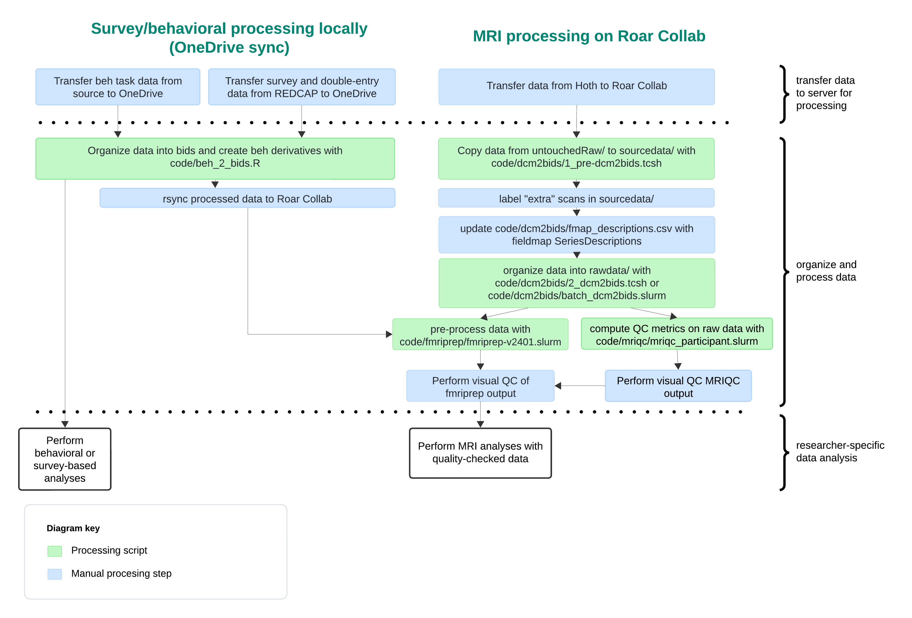

<!-- omit in toc -->
# Data Management and Processing Manual for Study REACH

- [Introduction](#introduction)
- [Data servers](#data-servers)
  - [OneDrive](#onedrive)
  - [Roar Collab](#roar-collab)
  - [Hoth](#hoth)
- [Data Storage and Organization](#data-storage-and-organization)
  - [untouchedRaw](#untouchedraw)
  - [bids](#bids)
    - [bids/sourcedata](#bidssourcedata)
    - [bids/rawdata](#bidsrawdata)
    - [bids/phenotype](#bidsphenotype)
    - [bids/derivatives](#bidsderivatives)
    - [bids/code](#bidscode)
- [Data Processing Pipeline](#data-processing-pipeline)
  - [Overview](#overview)
  - [Required access](#required-access)
  - [Required software](#required-software)
  - [Processing steps](#processing-steps)
    - [1. Transfer data to servers for processing](#1-transfer-data-to-servers-for-processing)
    - [2: Process Survey and Task Data](#2-process-survey-and-task-data)
    - [3. Sync processed survey and task data to Roar Collab](#3-sync-processed-survey-and-task-data-to-roar-collab)
    - [4. Process MRI data on Roar Collab](#4-process-mri-data-on-roar-collab)
- [Data Quality Control](#data-quality-control)
    - [Survey data](#survey-data)
    - [MRI data](#mri-data)
- [Using the data](#using-the-data)
    - [General usage notes](#general-usage-notes)
    - [Using phenotype data](#using-phenotype-data)
      - [Combining datasets](#combining-datasets)
    - [Using rawdata](#using-rawdata)
    - [Using derivative data](#using-derivative-data)
  - [Correcting data entry/collection errors](#correcting-data-entrycollection-errors)


# Introduction

Welcome! This manual outlines the data management and processing protocol for project REACH.

If you have questions, reach out to Bari Fuchs at baf44@psu.edu.

# Data servers

Managing and processing REACH data requires connecting to several servers. 

## OneDrive

OneDrive is the cloud storage service used by Penn State. Survey and task data are stored on OneDrive and processed locally (i.e., on your computer)using OneDrive Sync. With OneDrive Sync, files on OneDrive are synced to your computer, where they can be processed (e.g., with R); processed files are then synced to OneDrive.

[Setting up OneDrive Sync](https://support.microsoft.com/en-us/office/sync-files-with-onedrive-in-windows-615391c4-2bd3-4aae-a42a-858262e42a49)

## Roar Collab

Roar Collab is Penn State's Linux-based High Performance Computing Cluster. This is where MRI data are stored, processed, and analyzed. Survey and behavioral dat are synced to Roar Collab after processing so they can be used in MRI analyses. 

Processing data on Roar Collab involves using a command-line interface to navigate to directories and run shell scripts. Thus, familiarity with basic [linux commands](https://www.hostinger.com/tutorials/linux-commands) is recommended. 

Roar Collab can be accessed via SSH and through an interactive deskop. 

<!-- omit in toc -->
### Connecting via SSH
To connect via SSH, open a terminal on macOS or Linux or the command prompt on Windows and enter the following command, replacing <userid> with your Penn State user ID (e.g., baf44):

```bash
ssh <userid>@submit.hpc.psu.edu
```
This will prompt you to enter your password.

<!-- omit in toc -->
### Using interactive desktop

To start an interactive desktop, sign into the Penn State Roar Collab Portal at [https://rcportal.hpc.psu.edu/pun/sys/dashboard](https://rcportal.hpc.psu.edu/pun/sys/dashboard) and launch a new Interactive Desktop.


For more details on using Roar Collab, see the Roar Collab User Guide [here](https://www.icds.psu.edu/roar-collab-high-performance-computing-overview/).

## Hoth

Hoth is the server where SLEIC uploads MRI data, which we then copy to Roar Collab.  

Hoth can also be connected to via an SSH connnection with linux.imaging.psu.edu. To connect via SSH, open a terminal on macOS or Linux or the command prompt on Windows and enter the following command, replacing <userid> with your Penn State user ID (e.g., baf44):

```bash
# SSH into Hoth
ssh <userid>@linux.imaging.psu.edu
```

# Data Storage and Organization

Data are stored on 2 servers:

1. OneDrive (The cloud storage service used by Penn State)
2. Roar Collab (Penn State's High Performance Computing Cluster)

Survey and behavioral task data are stored on both servers, while MRI data is stored on Roar Collab only (due to file size).

Data on [OneDrive](#onedrive) are stored in the folder: 
b-childfoodlab_Shared > Active_Studies > MarketingResilienceRO1_8242020 > ParticipantData

Data on [Roar Collab](#roar-collab) are stored in the folder:
storage > group > klk37 > default > R01_Marketing

On OneDrive, the directory structure looks like:
- b-childfoodlab_Shared
  - Active_Studies
    - MarketingResilienceRO1_8242020
      - ParticipantData
         - **untouchedRaw**
         - **bids**
           - **sourcedata**
           - **rawdata**
           - **phenotype**
           - **derivatives**
           - **code**
  
On Roar Collab, the directory structure looks like:
- storage
  - group
    - klk37
      - default
        - R01_Marketing 
           - **untouchedRaw**
           - **bids**
             - **sourcedata**
             - **rawdata**
             - **phenotype**
             - **derivatives**
             - **code**

Notice that the sub-directories within ParticipantData/ (on OneDrive) and R01_Marketing/ (on Roar Collab) are the same. This enables syncing files in untouchedRaw/ and bids/ between the servers. 

Via data processing, data flows from (a) data source to (b) untouchedRaw/ to (c) bids/sourcedata/ to (d) bids/phenotype/ for survey data and bids/rawdata/ for task/beh and MRI data to (e) bids/derivatives (Figure 1). The contents of these folders are summarized in Table 1 and detailed in subsections below.


 \
Figure 1. Data Flow


Table 1. Directories and descriptions
| Directory    | Description |
| -------- | ------- |
| untouchedRaw  |  Contains task data in its rawest form. Data in this folder serves as a backup and should never be directly worked from.  |
| bids | Contains survey*, task, and neuroimaging data across differnt stages of processing, organized according to BIDS standards   |
| bids/sourcedata    | Contains copies of task and neuroimaging data from untouchedRaw and survey data downloaded from redcap. Data in this folder will be organized into bids/rawdata and bids/phenotype 
| bids/rawdata    | Contains task and neuroimaging data organized according to BIDS standards|
| bids/phenotype    | Contains survey data organized according to BIDS standards |
| bids/derivatives    | Contains processed data or generated datasets |
| bids/code    | Contains code to organize and process data within bids/ |

\* Survey refers to data collected in survey format via redcap, including questionnaires and researcher-entered data (e.g., intake measurements) 


## untouchedRaw

untouchedRaw/ contains task and MRI data transferred directly from the source (for task data, the source is where the task program exports the data; for MRI (DICOM) data, the source is Hoth, a server where SLEIC uploads the data). untouchedRaw/ is organized by task, such that data for each task is found within a task-specific folder:

  - untouchedRaw
    - foodview_task
    - hrv
    - nih-toolbox
    - pit_task
    - rrv_task
    - rsa
    - space_game
    - sst
    - tictach_task
    - DICOMS * 

*DICOMS are stored on Roar Collab only due to size

## bids

Data within bids/ are organized to comply with the [Brain Imaging Data Structure](https://bids.neuroimaging.io/). 

### bids/sourcedata

bids/sourcedata/ contains copies of data from untouchedRaw/. However, data are now organized by subject and session: each subject has a folder (sub-{label}) in /sourcedata, and within each subject folder are session folders (ses-{label}). Session folders  separate data collected at baseline (REACH visits 1 through 4) and follow-up (REACH visit 5). Within session folders, task data are stored in beh/ and MRI data are stored in dicom/. 

bids/sourcedata/ also contains survey data downloaded from REDCap, stored in /phenotype.

This looks like: 
- bids
  - sourcedata
    - sub-{label}
      - ses-1
        - dicom
          - [Imaging data collected at baseline]
        - beh
          - [Task files collected at baseline]
      - ses-2
        - beh
          - [Task files collected at follow-up]
    - phenotype
      - [redcap .tsv files]


### bids/rawdata

This folder contains "raw" task and MRI data that has been minimally processed from [bids/sourcedata/](#bidssourcedata) to comply with BIDS standards. When publically sharing task and MRI data, this is the data that gets shared. Similar to bids/sourcedata/, bids/rawdata/ is organized by subject and session. However, subdirectories will differ by modality: MRI data is stored in fmap/, func/, and anat/. Task data is stored in func/ if it was collected alongside fMRI data and beh/ if it was not.

Meta-data for files in bids/rawdata are stored in corresponding JSON files. For MRI data (i.e., nii.gz files), JSONS are subject specific, so they are stored in subject folders alongside the MRI data. For task data (i.e., TSV files), JSONS are stored directly in rawdata/ and apply to all corresponding files in subject and session directories.

This looks like: 
- bids
  - rawdata/
    - [Behavioral task meta-data JSONS]
    - sub-{label}/
      - ses-1/
        - fmap/
          - [Field map MRI data - these end with *.nii.gz]
          - [Field map meta-data JSON files]
        - func/
          - [fMRI data for Food View Task and SST - these end with *.nii.gz]
          - [fMRI meta-data JSON files]
          - [Behavioral data for Food View task and fMRI SST - these end with *_events.tsv]
        - anat/
          - [Structural MRI data - these end with *.nii.gz]
          - [Structural MRI meta-data JSON file]
        - beh/
          - [Behavioral data for tasks *not* collected alongside fMRI data - these end with *_beh.tsv]
      - ses-2/
        - beh/
          - [Behavioral data for tasks *not* collected alongside fMRI data - these end with *_beh.tsv]

Remember, MRI data (i.e., nii.gz files) will only exist on Roar Collab due to size. Task data (i.e., TSV files) can be synced between OneDrive and Roar Collab. 

### bids/phenotype

This folder contains questionnaire, intake, anthropometrics, and dexa data stored in .tsv files. Data for each survey is saved in its own file. TSVs contain raw data, and can also contain derivative data (e.g., questionnaire scores, computed variables). Each data file is accompanied by a JSON meta-data file.

For example:

- bids
  - phenotype
    - {survey-name}.tsv
    - {survey-name}.json


### bids/derivatives

This folder contains datasets that have been derived from data in [bids/rawdata/](#bidsrawdata). The following derivative datasets have been created:

- bids
  - derivatives
    - mriqc
      - [Quality assessment files generated by mriqc]
    - preprocessed/fmriprep_v2401
      - [Preprocessed fmri data, output of fmriprep version 24.0.1]
    - beh
      - [TSV files with summary metrics for each behavioral task]


### bids/code

This folder contains code to organize and process data within bids/.


# Data Processing Pipeline

## Overview

The data processing pipeline encapsulates steps to get data from its source into analysis-ready formats. 

The steps are:

1. Transfer data to servers for processing
   1. Download survey data from REDCap to OneDrive
   2. Copy task data from administration computer to OneDrive
   3. Copy MRI data from Hoth to Roar Collab
2. Process survey and task data on OneDrive
   1. Get data into BIDS
   2. Generate derivative databases with summary metrics
3. Sync survey and task data to Roar Collab
4. Get MRI data into BIDS
   1. Copy data into sourcedata/
   2. Label "extra scans"
   3. Add field map desciription to fmap_descriptions.csv
   4. Convert MRI data to BIDS in rawdata/
5. Generate QC metrics with MRIQC
6. Pre-process data with fMRIprep


 \
Figure 2. Data processing steps

These steps will be described in detail below. 


## Required access
Implementing the described pipeline will require access to projects/folders in:
- REDCap (online data collection software)
- OneDrive (Microsoft's cloud storage service used by Penn State)
- Hoth (server where SLEIC uploads imaging data)
- Roar Collab (Penn State's High Performance Computing Cluster)

Steps to aquire access are outlined in Table 2.

Table 2. Access required for data processing
<div style="font-size: 12px;">

| Server | Project/Folder | Getting Server Access | Getting project/folder access | Required To... |
| -------- | ------- | ------- | ------- | ------- |
| REDCap | 'Food Marketing Resilience/Project REACH' and 'REACH Data Double Entry' projects | Go to https://ctsi.psu.edu/research-support/redcap/ and select "REQUEST REDCAP ACCESS (NEW USERS"; Requires REDCap training | ask Kathleen Keller (klk37@psu.edu) to grant access | download Survey data from REDCap |
| OneDrive |  b-childfoodlab_Shared/ | Students and staff with @psu.edu emails automatically get access | ask Kathleen Keller (klk37@psu.edu) to grant access | transfer and access task (beh) and survey data on OneDrive |
| Hoth |  /nfs/imaging-data/3Tusers/klk37/mrkt/ | email	l-sleic-helpdesk@lists.psu.edu and request access, cc Kathleen Keller (klk37@psu.edu)  | email	l-sleic-helpdesk@lists.psu.edu and request access, cc Kathleen Keller (klk37@psu.edu) | retrieve MRI data after SLEIC uploads it to Hoth |
| Roar Collab |  storage/group/klk37/ | follow instructions at https://www.icds.psu.edu/account-setup/  | email iask@ics.psu.edu and request access, cc Kathleen Keller (klk37@psu.edu) | copy MRI data to Roar Collab; access and process MRI data on Roar Collab; sync task and survey data from OneDrive to Roar Collab|

<div style="font-size: 16px;">


## Required software 

Implementing the processing pipeline requires the following software to be available either locally (for processing survey and task data that are available on your computer with OneDrive Sync) or on Roar Collab (for processing MRI data).

<!-- omit in toc -->
### R01_Marketing
* [https://github.com/bfuchs18/R01_Marketing](https://github.com/bfuchs18/R01_Marketing)
* This github repository contains R, Python, and shell scripts to organize, processess, and analyze REACH data. These are located in ParticipantData/bids/code.
* The scripts in this repositiory call the software outlined below. 
* Scripts in this repo are need locally and on Roar Collab.

<!-- omit in toc -->
### R
* [https://www.r-project.org/](https://www.r-project.org/)
* This software is needed locally
* R is a software environment for statistical computing and graphics and is required to process task and survey data using [dataREACHr](#datareachr) and [dataprepr](#dataprepr)


<!-- omit in toc -->
### dataREACHr
* [https://github.com/bfuchs18/dataREACHr](https://github.com/bfuchs18/dataREACHr)
* This software is needed locally
* This is an R package that contains functions to process and organize survey and task data into bids/phenotype and bids/rawdata, respectively.
* dataREACHr can be installed from github in R using the devtools package:
```r
devtools::install_github("bfuchs18/datareachr")
```
<!-- omit in toc -->
### dataprepr

* [https://github.com/alainapearce/dataprepr](https://github.com/alainapearce/dataprepr)
*  This software is needed locally
* This is an R package that contains functions to score a variety of validated questionnaires
* This is a dependecy of [dataREACHr](#datareachr) -- loading dataREACHr will prompt installation of dataprepr if it is not installed. 
* Dataprepr can also be installed from github in R using the devtools package:

```r
devtools::install_github("alainapearce/dataprepr")
```

<!-- omit in toc -->
### dcm2bids
*  [https://unfmontreal.github.io/Dcm2Bids/3.1.1/](https://unfmontreal.github.io/Dcm2Bids/3.1.1/)
*  This software is needed on Roar Collab
*  This is a program that reorganises NIfTI files into the Brain Imaging Data Structure (BIDS).
*  Data processing scripts expect dcm2bids to be loaded via a conda environment described in [/bids/code/dcm2bids/dcm2bids.yml](https://github.com/bfuchs18/R01_Marketing/blob/master/ParticipantData/bids/code/dcm2bids/dcm2bids.yml). 
*  

dcm2bids.yml is present on Roar Collab, so the conda env can be created by running the following commands in a Bash terminal on Roar Collab

```bash
# if conda has not been initialized, may need to run this first and then close and reopen terminal
conda init bash 

# Navigate to yml file
cd /storage/group/klk37/default/R01_Marketing/bids/code/dcm2bids/

# Load anaconda
module load anaconda

# Create a conda environment based on yml file
## Note, this will create the conda env in a user-specific directory, so every user has to create their own environemnt
conda env create -f dcm2bids.yml

# activate enviroment
conda activate dcm2bids
```

<!-- omit in toc -->
### pydeface
*  [https://github.com/poldracklab/pydeface](https://github.com/poldracklab/pydeface)
*  This software is needed on Roar Collab
*  This is a tool to remove facial structure from (i.e., "deface") MRI images. 
*  Data processing scripts expect pydeface to be loaded via a conda environment described in /bids/code/dcm2bids/dcm2bids.yml. See the [dcm2bids](#dcm2bids) section for details on how to create the conda environment.

<!-- omit in toc -->
### mriqc
* [https://mriqc.readthedocs.io/en/stable/index.html](https://mriqc.readthedocs.io/en/stable/index.html)
* MRIQC extracts no-reference IQMs (image quality metrics) from structural (T1w and T2w) and functional MRI (magnetic resonance imaging) data. 

A container with MRIQC version 24.0.0 was built by running the following command in a Bash terminal on Roar Collab
```bash
singularity build /storage/group/klk37/default/sw/mriqc-24.0.0.simg  docker://nipreps/mriqc:24.0.0
```

<!-- omit in toc -->
### fmriprep
* [https://fmriprep.org/en/stable/outputs.html](https://fmriprep.org/en/stable/outputs.html)
* This software is needed on Roar Collab
* fMRIprep is a preprocessing software for MRI data
* On Roar Collab, fMRIprep version 24.0.1 is available in a Singularity Container within /storage/group/klk37/default/sw/fmriprep-23.2.0.simg. By using this singularity container, we can use a version of fMRIprep that is not presently available to all users of Roar Collab.

The container was created by running the following command in a Bash terminal on Roar Collab
```bash
singularity build /storage/group/klk37/default/sw/fmriprep-24.0.1.simg docker://nipreps/fmriprep:24.0.1
```

* Version 24.0.1 was selected for processing because it is (or was) the most recent version available. To use other versions, build another singularity container by specifying a different version number in the command above

<!-- omit in toc -->
### afni
* [https://afni.nimh.nih.gov/](https://afni.nimh.nih.gov/)
* This software is needed on Roar Collab
* On Roar Collab, AFNI version 24.2.01 is available in a Singularity Container within /storage/group/klk37/default/sw/afni-24.2.01.simg. By using this singularity container, we can use a version of AFNI that is not presently available to all users of Roar Collab.

The container was created by running the following command in a Bash terminal on Roar Collab
```bash
# If 24.2.01 is the latest version available (check tags to see AFNIs latest push: https://hub.docker.com/r/afni/afni_make_build/tags), can use this command:
singularity pull afni-24.2.01.simg docker://afni/afni_make_build

# pull version 24.2.01
singularity pull afni-24.2.01.simg docker://afni/afni_make_build:AFNI_24.2.01

```

## Processing steps
### 1. Transfer data to servers for processing

Before we can begin processing any data, we need to copy data from their source to the server in which they will be processed. For survey and task data, this is OneDrive. For MRI data, this is Roar Collab. 

<!-- omit in toc -->
#### 1.1. Transfer survey data from REDCap to OneDrive

   1. Log in to redcap at [https://redcap.ctsi.psu.edu/](https://redcap.ctsi.psu.edu/)
   2. Download visit data
      1. Navigate to the REDCap project: Food Marketing Resilience/Project REACH
      2. Select 'Data Exports, Reports, and Stats'
      3. Select 'Export data' for the Report Name '**All data** (all records and fields)'
      4. Choose export format: 'CSV/Microsoft Excel (raw data)'
      5. Select export then click icon to download
      6. Transfer file to OneDrive Folder: b-childfoodlab_Shared/Active_Studies/MarketingResilienceRO1_8242020/ParticipantData/bids/sourcedata/phenotype
   3. Download double-entry data
      1. Navigate to the REDCap project: REACH Data Double Entry
      2. Select 'Data Exports, Reports, and Stats'
      3. Select 'Export data' for the Report Name '**All data** (all records and fields)'
      4. Choose export format: 'CSV/Microsoft Excel (raw data)'
      5. Select export then click icon to download
      6. Transfer file to OneDrive Folder: b-childfoodlab_Shared/Active_Studies/MarketingResilienceRO1_8242020/ParticipantData/bids/sourcedata/phenotype

<!-- omit in toc -->
#### 1.2. Copy task data from its source to OneDrive

   1. Locate task data at the source
      1. This location is task-specfic; it is typically on the computer used to administer the task (Table 3)
   2. Copy data onto OneDrive into the task-specific folder in [untouchedRaw/](#untouchedraw) (i.e., b-childfoodlab_Shared/Active_Studies/MarketingResilienceRO1_8242020/ParticipantData/untouchedRaw/)
      1. This should happen as soon as possible after data is collected. 
         1. Unlike OneDrive, the computers used for task data collection are not permanent storage locations and are not backed up. 
         2. Do not delete the data from the source. It can remain in that location as a backup until computer resources require files to be removed.
   3. If needed, rename the file in untouchedRaw to adhere to the expected file naming convention (Table X),
  
Table 3. Copying Task Data to untouchedRaw/ on OneDrive
<div style="font-size: 12px;">

| Task    | Data to tranfer | Where data is initially exported | Folder in untouchedRaw | untouchedRaw Naming Convenction |
| ------ | ------ | ------ | ------ | ----- |
| Reinforcing Value of Food Task | `game.csv` <br> `summary.csv` <br> `REACH_{ID}.txt`| On the laptop used for administation in XXX | rrv_task/REACH_{ID} | `rrv_{ID}_game.csv` <br> `rrv_{ID}_summary.csv` <br> `rrv_{ID}.txt` 
| Stop Signal Task | `stop_onsets-{ID}.txt` <br> `stop-{ID}.txt` | On the laptop used for administation in XX| sst | `stop_onsets-{ID}.txt` <br> `stop-{ID}.txt`
| Food View Task | `foodview_onsets-{ID}.txt` <br> `foodview-{ID}.txt` | On the laptop used for administation in XX | foodview_task | `foodview_onsets-{ID}.txt` <br> `foodview-{ID}.txt`
| NIH Toolbox | `{Date} Assessment Data.csv` <br> `{Date} Assessment Scores.csv`  <br> `{Date} Registration Data.csv` | | nih-toolbox |
| Space Game | | |  space_game |
| Pavlovian-to-Intrumental Transfer Task | | On the laptop used for administration in: C:\Project REACH\PIT_Task\Food_PIT| pit_task |

<div style="font-size: 16px;">

<!-- omit in toc -->
#### 1.3. Copy MRI data from Hoth to Roar Collab

Hoth is the server that SLIEC uploads MRI data to. Roar Collab is the server where the Keller Lab stores and processes MRI data. Data needs to be securely copied (scp) from Hoth to Roar Collab 

    Below is an example of copying data for subject 001; You will need to replace 'user' with your PSU username (e.g., baf44) \

<!-- omit in toc --> 
#### From a terminal, log into Hoth
```bash
# SSH into Hoth
ssh user@submit.hpc.psu.edu

# navigate to where SLEIC uploads data
cd /nfs/imaging-data/3Tusers/klk37/mrkt

# list contents of mrkt directory
ls

# rename subject's data directory to follow formatting mrkt_000
mv mrkt_1 mrkt_001
```
<!-- omit in toc --> 
#### From a separate terminal, log into Roar Collab
```bash
# SSH into Roar Collab
ssh user@submit.hpc.psu.edu

# navigate to where data will be copied to
cd /storage/group/klk37/default/R01_Marketing/untouchedRaw/DICOMS

# copy data from Hoth into current directory (on Roar Collab -- signaled with '.')
scp -r user@linux.imaging.psu.edu:/nfs/imaging-data/3Tusers/klk37/mrkt/mrkt_001 ./

# list contents of directory to confirm all files were transferred
ls 
```

### 2: Process Survey and Task Data

Once survey and task data exist on OneDrive (steps 1.1-1.2), we can begin processing them. The recommendation is to process data locally (i.e., with OneDrive files synced to computer) and then sync processed files to Roar Collab for use with MRI analyses. 

Survey and task data are processed and organized into BIDS using the script [beh_into_bids.R](https://github.com/bfuchs18/R01_Marketing/blob/master/ParticipantData/bids/code/beh_into_bids.R) which is shared in the [R01_Marketing GitHub Repository](##r01_marketing).

beh_into_bids.R was written to process files stored in OneDrive, provided they are synced to a local computer and the script is run locally. After processing data locally, beh_into_bids.R syncs data to Roar Collab.

Therefore, running beh_into_bids.R requires:
1. That [R](#r) is installed
2. That the R package [dataREACHr](#datareachr) its dependencies, including [dataprepr](#dataprepr), are installed. Details about installing dataREACHr and dataprepr can be found [here](#data-processing-software).
3. That the user has OneDrive files synced to their computer
4. That the script correctly specifies (1) the path to ParticipantData on OneDrive, (2) the names of REDCap files in sourcedata, and (3) the PSU user ID. To specify this information, modify the following lines of code in beh_into_bids.R:
```r
#### user setup (modify variables here) ####

# set path to ParticipantData directory on OneDrive (contains bids/ and untouchedRaw/)
base_dir = "/Users/baf44/Library/CloudStorage/OneDrive-ThePennsylvaniaStateUniversity/b-childfoodlab_Shared/Active_Studies/MarketingResilienceRO1_8242020/ParticipantData/"

# set redcap file names
visit_file_name =  "FoodMarketingResilie_DATA_2024-05-03_1132.csv"
double_entry_file_name = "REACHDataDoubleEntry_DATA_2024-04-08_1306.csv"

# Penn State user ID
## needed for syncing data between OneDrive and Roar Collab
user_id = "baf44"

```

Overview of beh_into_bids.R:

- Survey data is processed using dataREACHr::proc_redcap(). This function:
  * Imports visit and double-entry data downloaded from redcap
  * Calls dataREACHr and dataprepr functions to extract, process, and score data
  * Exports participants.tsv data files and participants.json meta-data files into [bids/](#bids).
  * Exports {survey}.tsv data files and {survey}.json meta-data files into [bids/phenotype/](#bidsphenotype).
- Task data is processed using dataREACHr::proc_task(). This function:
  * Copies task data from [bids/untouchedRaw](#untouchedraw) into [bids/sourcedata/](#bidssourcedata)
    * This is done with util_org_sourcedata(), which presently copies data for: food view task, stop signal task
  * Processes and exports task data into [bids/rawdata/](#bidsrawdata) for:
    * food view task (using util_task_foodview())
    * SST (using util_task_sst())
  * Exports a meta-data JSON file into bids/rawdata for the following tasks: foodview_bold, sst_bold, sst_beh
    * Done using write_task_jsons()
- Survey and Task data in untouchedRaw/ and bids/ on OneDrive (local) are synced to Roar Collab using rsync

### 3. Sync processed survey and task data to Roar Collab
### 4. Process MRI data on Roar Collab 

Once MRI data is on Roar Collab (step 1.3), we can being processing it. Organization of MRI data into bids/rawdata/ can without survey and task data being synced to Roar Collab. However, subsequent processing steps (MRIQC, fMRIprep) will require that task data (*_events.tsv files) have been synced to Roar Collab, 

1. SSH into Roar Collab
```
ssh
```

2. From Roar Collab, run data processing shell scripts

Process and organize MRI task data locally in R (requires having OneDrive synced):\
Note: events.tsv files are required for fmriprep, so this must be done before running fmriprep
- dataREACHr::proc_task()
- generate bids/rawdata/*/func/*events.tsv files 


To process and organize MRI data on Roar Collab, enter the following commands into a Bash or tcsh terminal:
```bash

### copy data from untouchedRaw/ into bids/sourcedata/ ###

# naviagate to directory with script
cd /storage/group/klk37/default/R01_Marketing/bids/code/dcm2bids

# run shell script for sub 001
./1_pre-dcm2bids.tsch 001

### Manual inspection and labeling of extra scans in sourcedata ###

### Organize MRI data into BIDS (bids/rawdata/) ###

# naviagate to directory with script
cd /storage/group/klk37/default/R01_Marketing/bids/code/dcm2bids

# activate dcm2bids conda env
conda activate dcm2bids

# run shell script for sub 001
./2_dcm2bids.tsch 001

```


# Data Quality Control

### Survey data
To increase quality of survey data:

1. Merged double-entered records are processed for the following measures: DEXA, intake (pre and post weights), WASI, fullness ratings, CAMS
   1. Data-double entry process: (1) 2 researchers enter the data into REDCap, (2) discrepencies between double-entered records are resolved by a reviwer, (3) records are merged when they match
2. The function dataREACHr::qc_redcap() checks for:
   1. Duplicate data (e.g., multiple rows for a given subject/session combination) in processed phenotype databases
   2. Child visit 1 ages out of expected range (7-9)
      1. This would suggest a mis-entry of child birthdate (by parent in [V1 demographics form](#visit-1-demographics)) or visit 1 protocol date (by researcher)
         1. If a parent mis-entered their child's birthdate in the V1 demographics form (e.g., entered the year of the study visit rather than child birth), the child birthdate in the V1 demographics form was updated by a researcher with the child birthdate provided by the parent during screening
   3. Negative consumption amounts??

### MRI data


# Using the data

### General usage notes


1. Never manually edit datasets in bids/rawdata, bids/phenotype, and bids/derivatives. 
   - This is because: (1) data are organized and processed using scripts found in bids/code. When datasets are re-processed or updated using these scripts, manual edits will be overwritten; and (2) these data are shared. Someone else using the datasets may be unaware of changes you made.
2. Reference .json files to understand the datasets.
   - JSON files (i.e., files with .json extension) contain metadata for corresponding .tsv files. Meta-data includes information such as variable descriptions and citations.
   - Within bids/phenotypes/, each TSV file is accompanied by a corresponding JSON file with the same basename 
   - Within bids/rawdata/, meta-data for task TSV files in subject/session sub-folders are stored directly in bids/rawdata.
     - E.g., metadata for /bids/rawdata/sub-001/ses-1/beh/sub-001_ses-1_task-sst_beh.tsv can be found within /bids/rawdata/task-sst_beh.json 
3. ??? Reference notes to understand the data ??? 
   1. To do: add something about where qualitative notes will be kept?? in specific databases or a notes database?? 
4. Specify 'n/a' as the value for missing data
  - In compliance with BIDS, 'n/a' is used to indicate missing data in rawdata and derivatives datasetes. To prevent software from interpreting 'n/a' as a string rather than missing data, it can be helpful to specify 'n/a' as the value to set as missing.

In R missing values can be specified at import:
```
# specify file path (update path to file)
path_to_file <- paste0('path/to/file.tsv')

# import data from TSV, specifying missing data values as "n/a"
data <- read.delim(path_to_file, na.strings = "n/a")
```

In SPSS missing values can be specified using the MISSING VALUES command. 


### Using phenotype data

#### Combining datasets
All datasets in bids/phenotype/ contain participant_id and session_id columns that indicate the subject identifier (e.g., sub-001) and when data were collected (i.e., ses-1/baseline or ses-2/follow-up), respectively. Data collected across multiple visits are stored in long format, meaning that within a dataset, a subject has a separate row for each session. Therefore, datasets can be merged by both participant_id and session_id columns.

Example: merge data in R, matching on participant_id and session_id
```
# load demo data
demo_data <- read.delim('path/to/demographics.tsv')

#  example demo_data:
#  participant_id session_id age
#           1     1          7
#           2     1          7
#           1     2          8
#           2     2          8

# load cebq data
cebq_data <- read.delim('path/to/cebq.tsv')

#  example cebq_data:
#  participant_id session_id cebq_value
#           1     1          3
#           2     1          2
#           1     2          1
#           2     2          5

# merge demographic and cebq data
merged_data <- merge(demo_data, cebq_data, by=c("participant_id","session_id"))

#  example merged_data:
#  participant_id session_id age  cebq_value
#           1     1          7      3
#           2     1          7      2
#           1     2          8      1
#           2     2          8      5

```

Example: merge data in SPSS
```

```

### Using rawdata

To do: recommendations for creating derivative datasets from rawdata? 

### Using derivative data


## Correcting data entry/collection errors

Data in bids/ are organized and processed using scripts found in bids/code. When datasets are re-processed or updated using these scripts, manual edits will be overwritten. Therefore data entry errors need to be fixed where data are stored prior to processing:
- For errors in phenotype/survey data, data need to be updated in REDCap. Then, REDCap data can be re-downloaded and reprocessed using dataREACHr
  - Example error in REDCap data: Values that were incorrectly transferred from paper to REDCap (e.g., anthropometrics, intake measurements)
- For errors in task data, data need to be updated in untouchedRaw. Then, they can be reprocessed into bids using dataREACHr
  - Example error in task data: data was improperly exported from task software  


